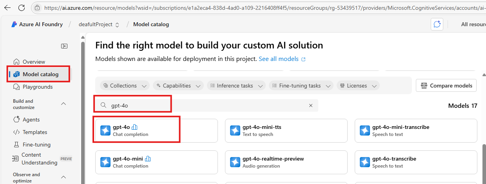
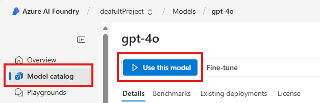
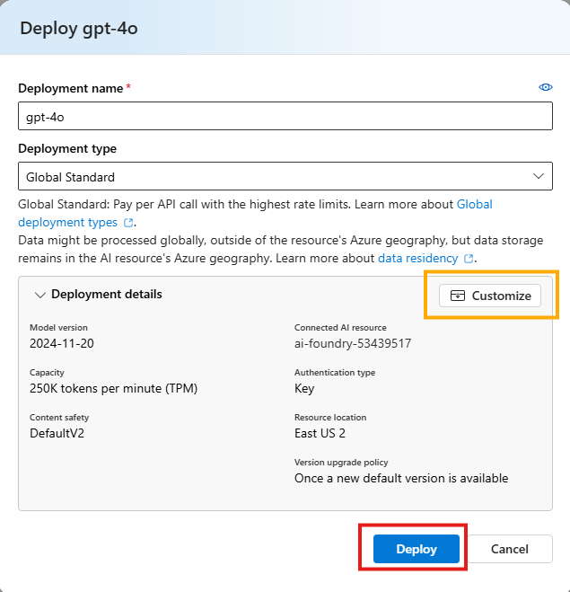
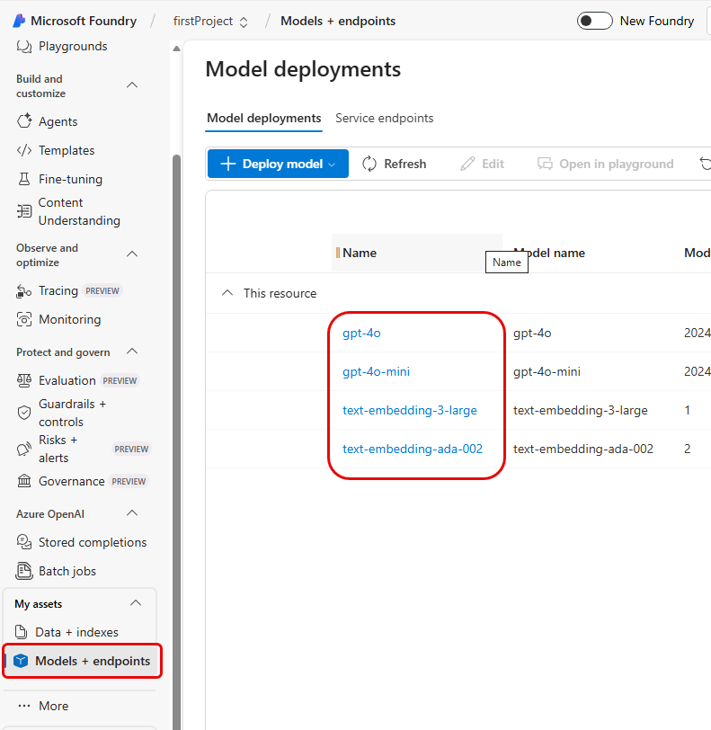

# Deploy models into the Microsoft Foundry Project

## Introduction 

This lab walks you through the steps to deploy various models into the **Microsoft Foundry** project.

## Objectives 

In this lab we will deploy the following models:

- text-embedding-3-large
- GPT-4o
- GPT-4o-mini	
- text-embedding-ada-002

## Estimated Time 

5 - 10 minutes 

## Scenario

You are deploying models that will be utilized later in the labs for several modules in this workshop.

## Pre-requisites

No pre-requisites

## 🛠️ Tasks

### 1. Ensure that you are on the Microsoft Foundry – Overview page

### 2. Deploy gpt-4o model

- [ ] In the left side menu, Click **Model catalog**
- [ ] At the center, scroll down and search +++gpt-4o+++
- [ ] Right Click on **gpt-4o** and click **Open link in new tab**

- [ ] Go to the newly opened tab for gpt-4o
- [ ] Click **Use this model** button

- [ ] For this lab, keep all defaults
- [ ] (Optional) Click **Customize** to review additional details
- [ ] Click **Deploy** button 

- [ ] After deployment completes, close the browser tab.

### 3. Deploy gpt-4o-mini model

- [ ] Repeat the steps above to deploy the +++**gpt-4o-mini**+++ model.

### 4. Deploy embedding model

- [ ] Repeat the steps above to deploy the +++**text-embedding-3-large**+++ model.

### 5. Deploy text-embedding-ada-002 model

- [ ] Repeat the steps above to deploy the +++**text-embedding-ada-002**+++ model.

## ✅ Completed. Verify models deployment

- [ ] In the left side menu, scroll down to the bottom, Click **Models + endpoints**
- [ ] You can see list of models deployed

