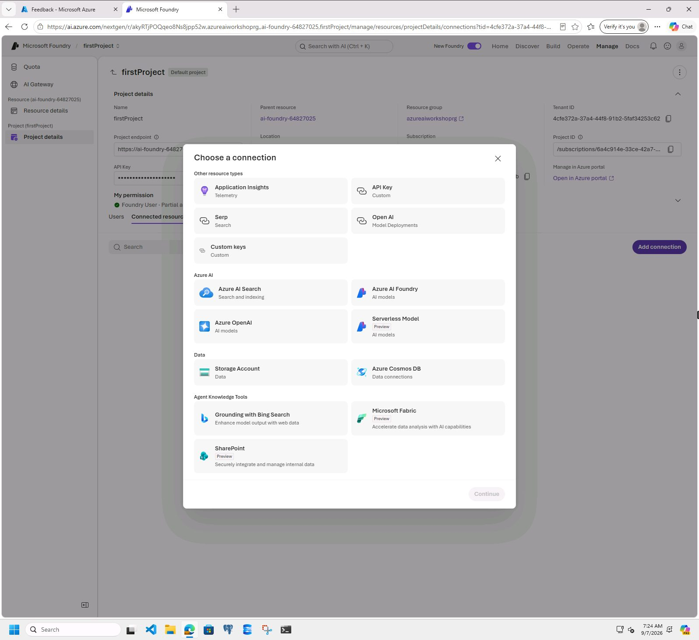
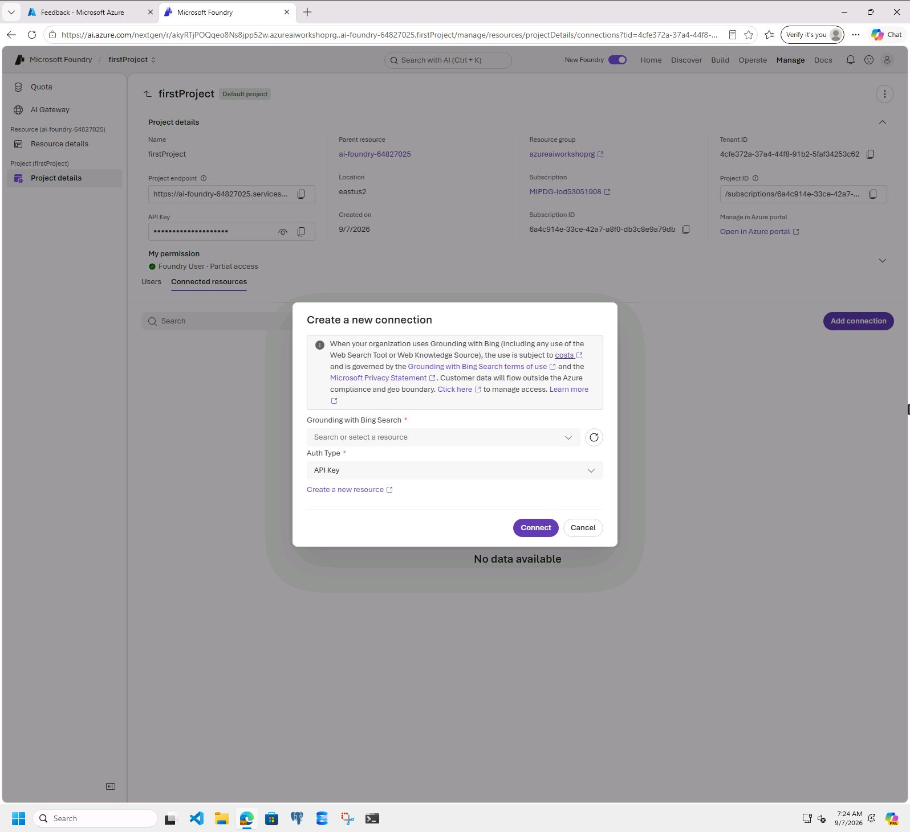
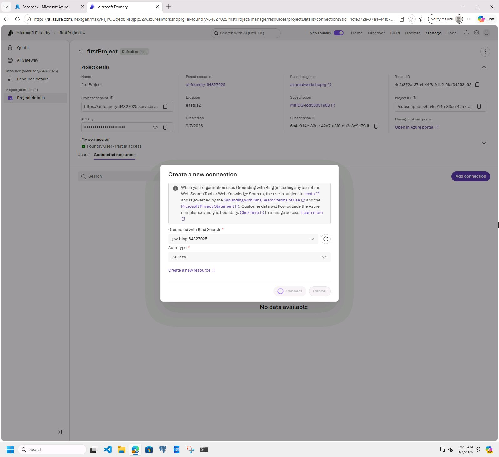
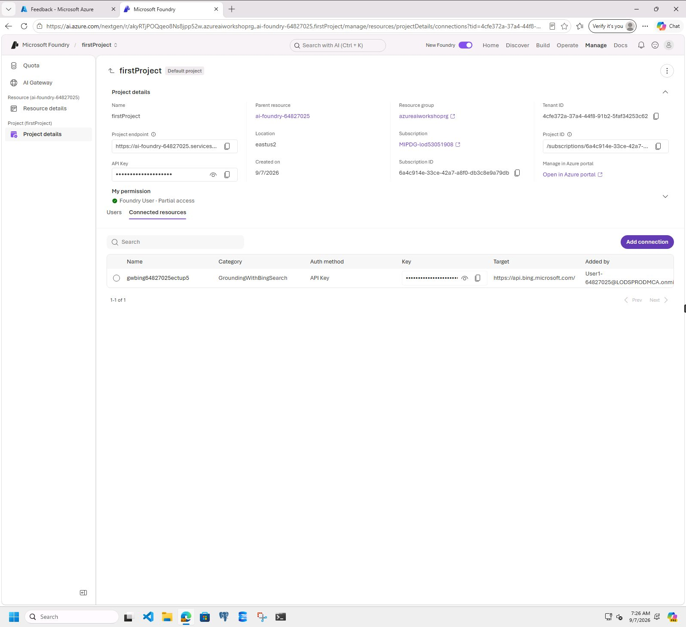

# Create connections to Bing Resources at Azure AI Foundry resource level

## Introduction 

This lab walks you through the steps to connect the Grounding with Bing Search resource to the Azure AI Foundry resource.

## Objectives 

In this lab we will:

- Connect the Grounding with Bing Search resource to the Azure AI Foundry resource.	

## Estimated Time 

5 minutes 

## Scenario

Connect the Grounding with Bing Search resource to the Azure AI Foundry resource.	

## Pre-requisites

No pre-requisites

## 🛠️ Tasks

### 1. Go to the Connected Resources section

- [ ] Login to Azure AI Foundry: +++https://ai.azure.com/+++
- [ ] In the top navigation, click **Manage**
- [ ] In the left side, under the Project section, click **Project details**
- [ ] Click the **Connected resources** tab

- [ ] Click **Add connection**
- [ ] Click **Grounding with Bing Search**

- [ ] Select the lab-provided Grounding with Bing Search resource
- [ ] Keep **API Key** as the Auth Type
- [ ] Click **Connect**

- [ ] After the connection completes, you are returned to the **Connected resources** table

## ✅ Completed. 

- [ ] Confirm that the Grounding with Bing Search connection is listed

