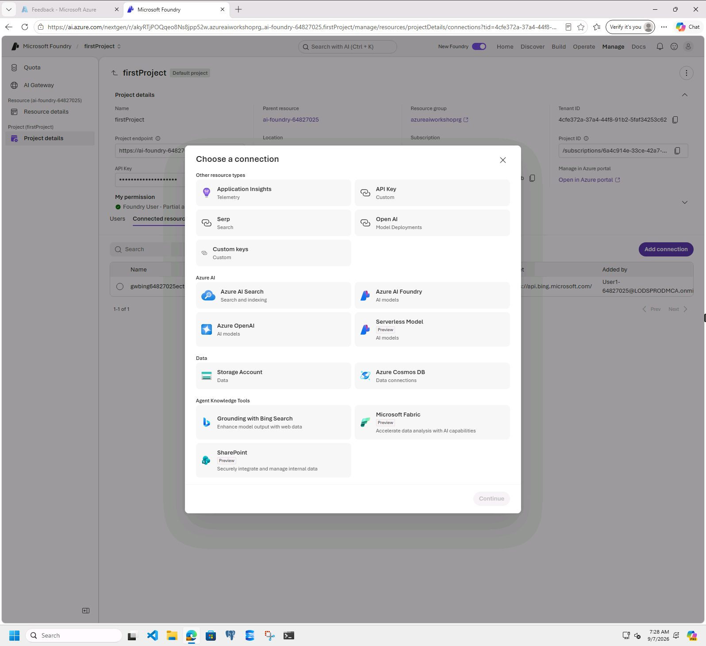
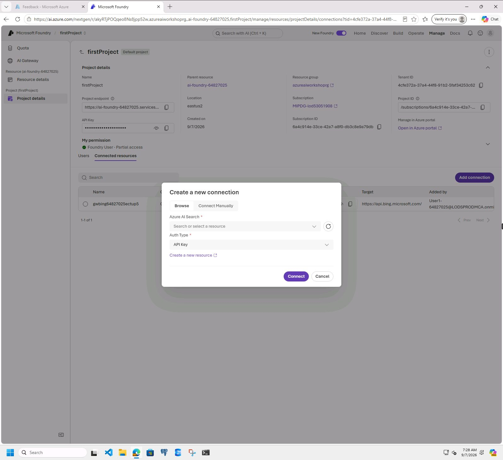
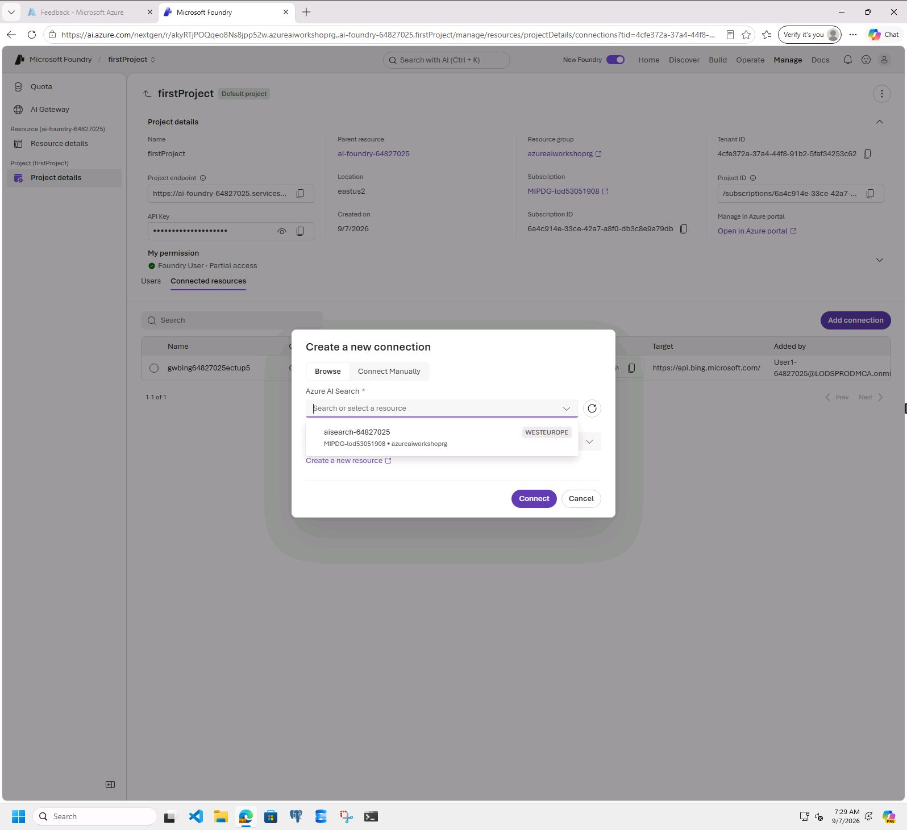
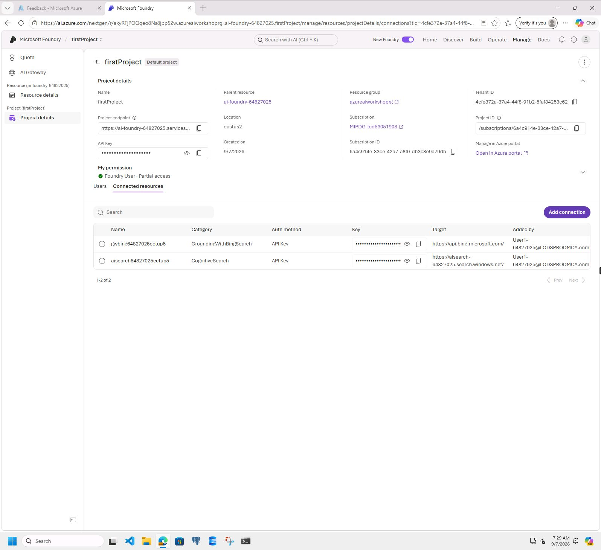

# Create connections to Azure AI Search at AI Foundry resource level

## Introduction 

This lab walks you through the steps to connect the Azure AI Search to the AI Foundry resource.

## Objectives 

In this lab we will:

-	Connect the Azure AI Search to the AI Foundry resource.

## Estimated Time 

5 minutes 

## Scenario

Connect the Azure AI Search to the AI Foundry resource.

## Pre-requisites

No Pre-requisites

## 🛠️ Tasks

### 1. Go to the Connected Resources section

 _Note: Skip this step if you are already on the **Connected resources** tab_

- [ ] Login to Azure AI Foundry: +++https://ai.azure.com/+++
- [ ] In the top navigation, click **Manage**
- [ ] In the left side, under the Project section, click **Project details**
- [ ] Click the **Connected resources** tab

- [ ] Click **Add connection**
- [ ] Click **Azure AI Search**

- [ ] Select the lab-provided Azure AI Search resource
- [ ] Keep **API Key** as the Auth Type
- [ ] Click **Connect**

- [ ] After the connection completes, you are returned to the **Connected resources** table

## ✅ Completed. 

- [ ] Confirm that the Azure AI Search connection is listed

