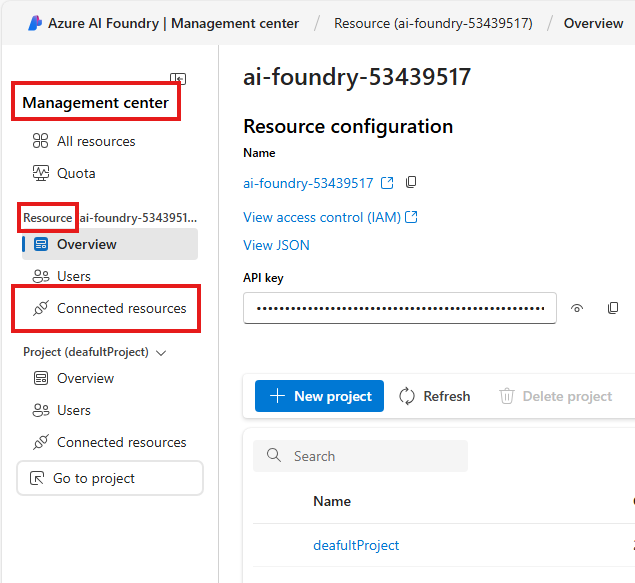
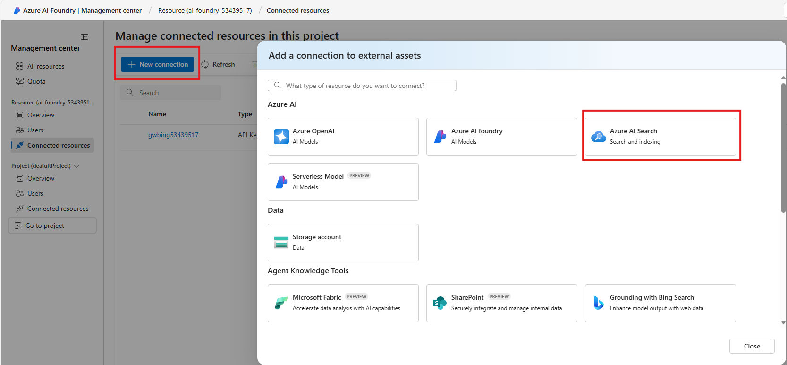
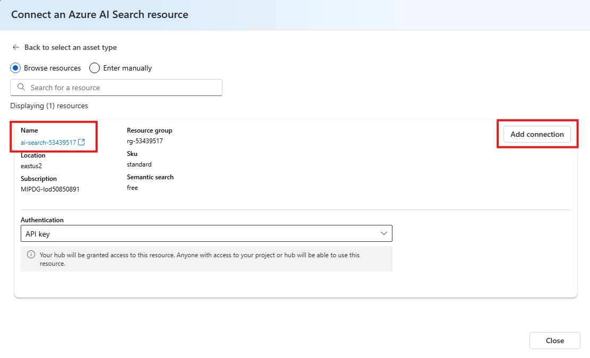
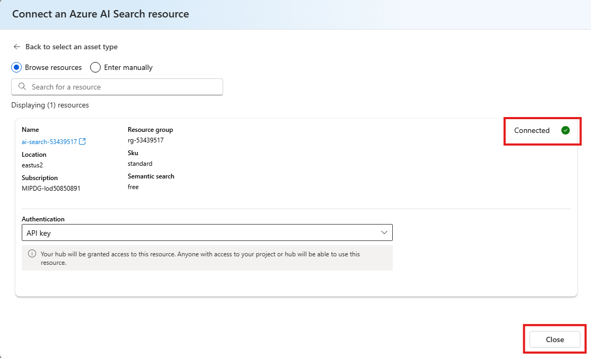
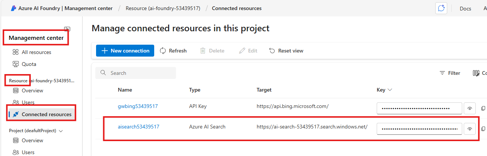

# Create connections to Azure AI Search at AI Foundry resource level

## Introduction 

This lab walks you through the steps to connect the Azure AI Search to the AI Foundry resource.

## Objectives 

In this lab we will:

-	Connect the Azure AI Search to the AI Foundry resource.

## Estimated Time 

5 minutes 

## Scenario

Connect the Azure AI Search to the AI Foundry resource.

## Pre-requisites

No Pre-requisites

## 🛠️ Tasks

### 1. Go to the Connected Resources section

 _Note: Skip this step if you are already in the Management center_

- [ ] Login to Azure AI Foundry: +++https://ai.azure.com/+++
- [ ] Left side, in the **Management center**, in the Resource section, Click **Connected resources**

- [ ] Click **+New connection**
- [ ] Click **Azure AI Search**

- [ ] Review the name of the AI Search service
- [ ] Click **Add connection** on the right

- [ ] You can see the green tick at the right with Connected label
- [ ] Click **Close** button

## ✅ Completed. 

- [ ] Left side, in the **Management center**, in the Resource section, Click **Connected resources**
- [ ] You can see list of connected resources

