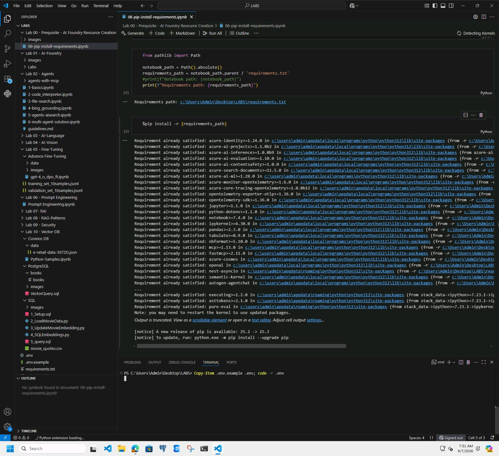
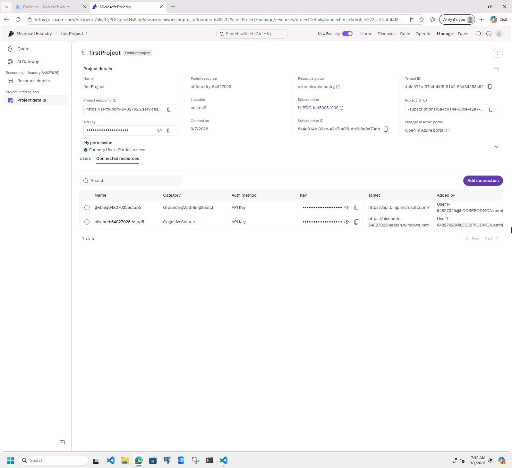
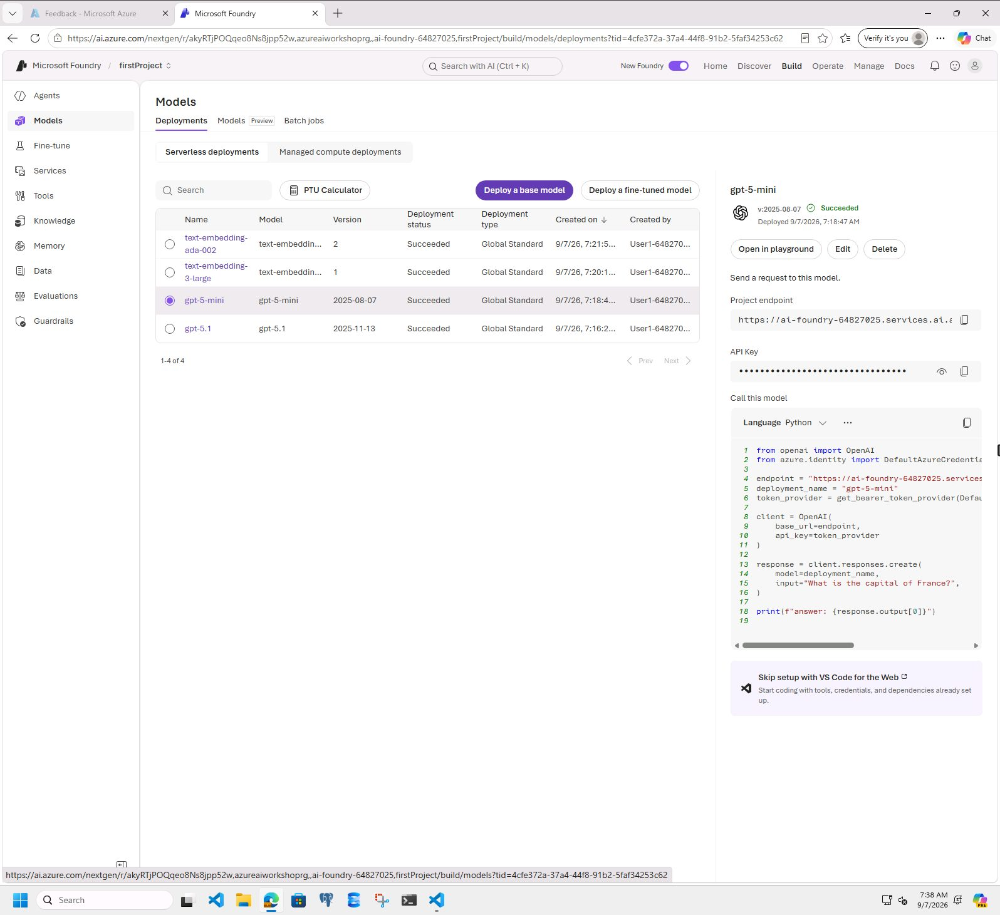
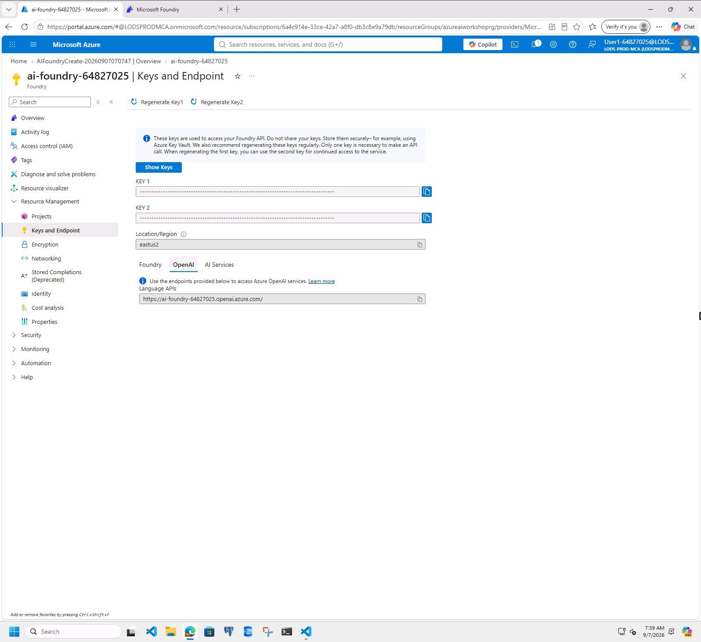
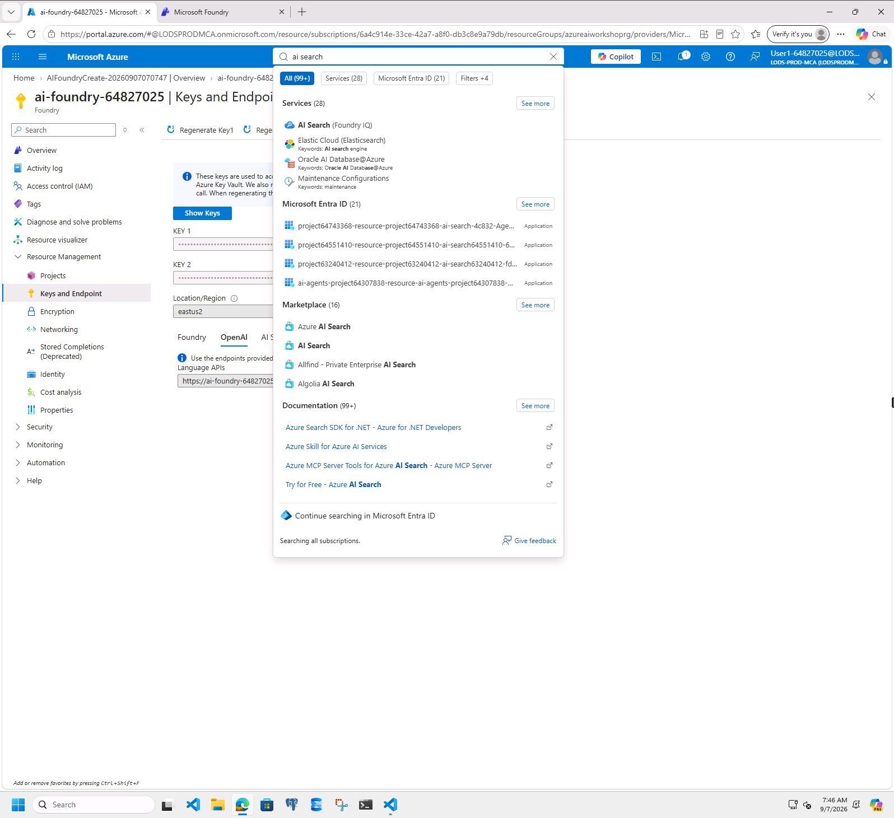
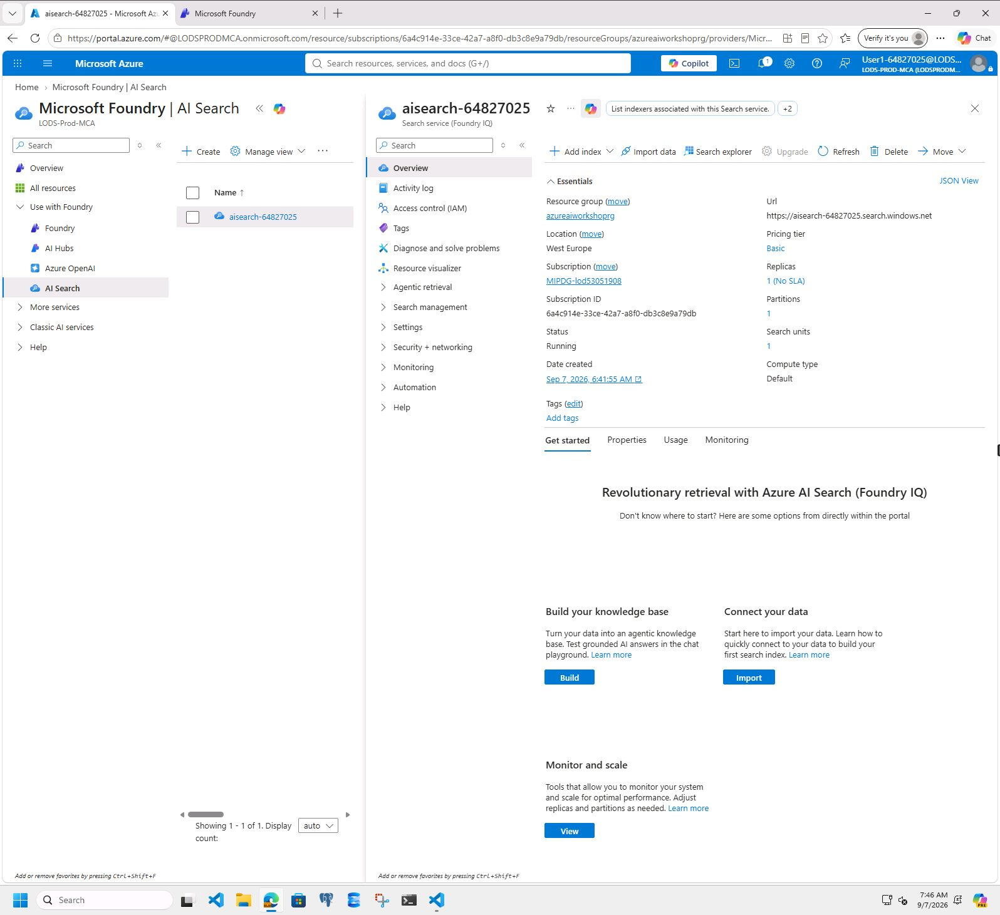
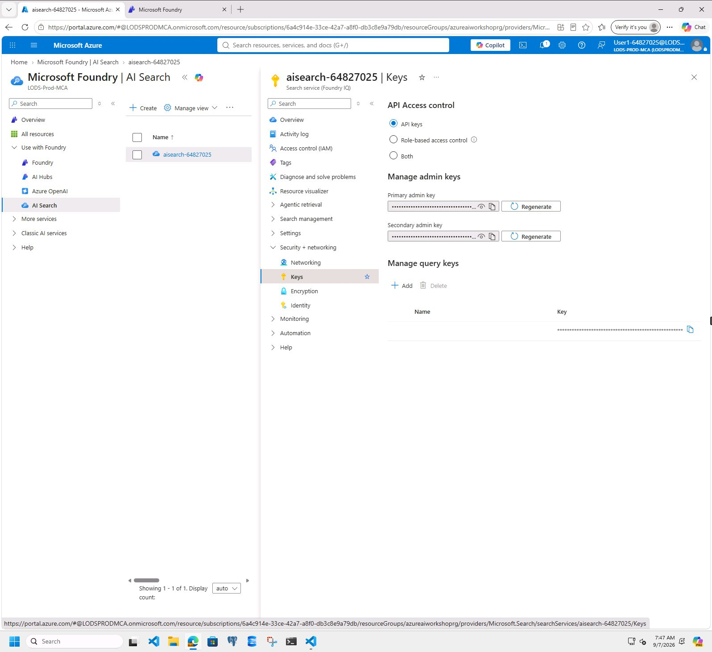
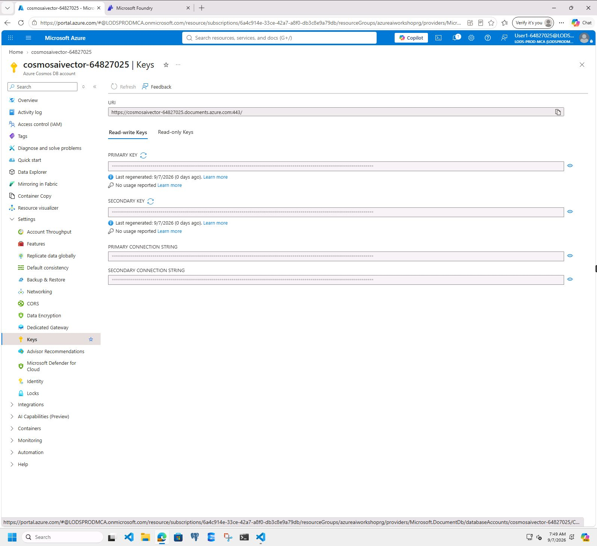
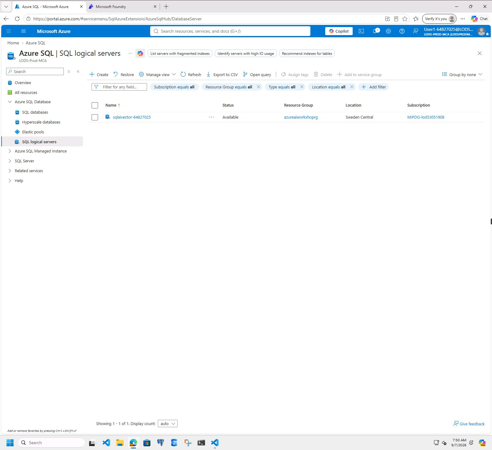
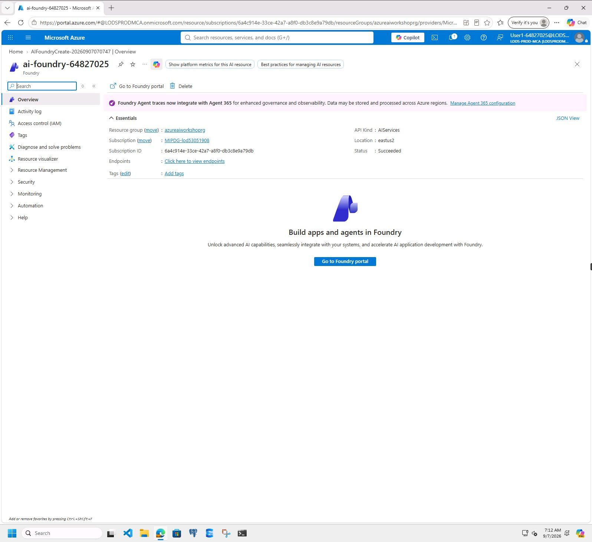

# Setup .env file

## Introduction

This lab walks you through the steps to setup the .env file as a mandatory step for getting ready for executing the LAB exercises. Note that while this .env file can be setup in a code-first approach using REST API or SDKS, this LAB wants you to do the setup in an interactive way for a learning experiece.

## Objectives

In this lab we will:

- Setup the .env file that will be leveraged to execute the lab exercises

## Estimated Time

15 minutes

## Scenario

Setup the .env file that will be leveraged to execute the lab exercises as an interactive way for a learning experience

## Pre-requisites

Complete the prerequisites Lab exercises

- [Create Azure AI Foundry Project](01-Create-Azure-Foundry-Project.md)
- [Deploy models into the Azure AI Foundry Project](02-Deploy-Models.md)
- [Create connections to Bing Resources at Azure AI Foundry resource level](03-Connect-to-Bing-Resources.md)
- [Create connections to Azure AI Search at AI Foundry resource level](04-Connect-to-Azure-AI-Search.md)

## 🛠️ Tasks

### 1. Copy .env.example as .env

- [ ] Find the .env.example file that is supplied as the template. You can find it in the root folder provided within the lab VM

- [ ] Copy .env.example to save as .env in the same folder location
- [ ] Edit .env to provide the actual value from your environment by following the steps
- [ ] Do not modify the section that is marked for not to modify

### 2. Go to the Microsoft Foundry – Overview page

- [ ] Go to [https://ai.azure.com](https://ai.azure.com/) 
- [ ] Sign in with your Azure credentials (if requested)

### 3. Set the values for the AI_FOUNDRY_PROJECT_ENDPOINT and AZURE_PROJECT_NAME variables

- [ ] In the top navigation, click **Manage**
- [ ] In the left side, under the Project section, click **Project details**
- [ ] Copy the **Project endpoint** and paste it into the .env file as the value for AI_FOUNDRY_PROJECT_ENDPOINT

- [ ] Copy and paste into .env file the AZURE_PROJECT_NAME value. 
  - The "AZURE_PROJECT_NAME" value is the last part of the endpoint string after the "/" (eg. firstProject)

### 4. Set the values for the AZURE_OPENAI_ENDPOINT and AZURE_OPENAI_API_KEY variables

- [ ] In Microsoft Foundry, click **Build** in the top navigation
- [ ] In the left side, click **Models**, then open the **Deployments** tab
- [ ] Confirm that the **gpt-5-mini** deployment has a status of **Succeeded**
- [ ] Paste +++gpt-5-mini+++ into .env as the value for MODEL_DEPLOYMENT_NAME

- [ ] Go to your Microsoft Foundry resource in the Azure portal
- [ ] In the left side, under **Resource Management**, click **Keys and Endpoint**
- [ ] Click the **OpenAI** tab
- [ ] Copy the **Language APIs** endpoint and paste it into .env as the value for AZURE_OPENAI_ENDPOINT
- [ ] Copy **KEY 1** and paste it into .env as the value for AZURE_OPENAI_API_KEY
- [ ] Paste +++2025-04-01-preview+++ into .env as the value for MODEL_API_VERSION

### 5. Set the values for the AZURE_OPENAI_EMBEDDING_ENDPOINT and AZURE_OPENAI_EMBEDDING_API_KEY variables

- [ ] Use the same **Language APIs** endpoint from the previous task for AZURE_OPENAI_EMBEDDING_ENDPOINT and AZURE_OPENAI_EMBEDDING_ADA_ENDPOINT
- [ ] Use the same **KEY 1** value for AZURE_OPENAI_EMBEDDING_API_KEY and AZURE_OPENAI_EMBEDDING_ADA_API_KEY
- [ ] Paste +++text-embedding-3-large+++ into .env as the value for EMBEDDING_MODEL_DEPLOYMENT_NAME
- [ ] Paste +++2024-02-01+++ into .env as the value for EMBEDDING_MODEL_API_VERSION
- [ ] Paste +++text-embedding-ada-002+++ into .env as the value for EMBEDDING_ADA_MODEL_DEPLOYMENT_NAME
- [ ] Paste +++2024-02-01+++ into .env as the value for EMBEDDING_ADA_MODEL_API_VERSION

### 6. Set the value for the GROUNDING_WITH_BING_CONNECTION_NAME variable

#### Go to the Connected Resources section

- [ ] In Microsoft Foundry, click **Manage** in the top navigation
- [ ] In the left side, under the Project section, click **Project details**
- [ ] Click the **Connected resources** tab
- [ ] You can see list of connected resources

- [ ] Copy the "Name" of the "Grounding with Bing Search" connection (Corresponding Target columns is https://api.bing.microsoft.com/) and paste into .env file as the value for GROUNDING_WITH_BING_CONNECTION_NAME

### 7. Set the values for the TENANT_ID, AZURE_RESOURCE_GROUP and AZURE_SUBSCRIPTION_ID variables

- [ ] In Microsoft Foundry, go to **Manage** > **Project details**
- [ ] Copy **Tenant ID** and paste it into .env as the value for TENANT_ID
- [ ] Copy **Resource group** and paste it into .env as the value for AZURE_RESOURCE_GROUP
- [ ] Copy **Subscription ID** and paste it into .env as the value for AZURE_SUBSCRIPTION_ID

### 8. Set the values for the AZURE_AI_SEARCH_ENDPOINT and AZURE_AI_SEARCH_API_KEY variables

- [ ] In the top search bar, type **ai search**
- [ ] Select **AI Search** (shown in the portal as **AI Search (Foundry IQ)**) from the search results
  
- [ ] You will see the AI Search service that you have created (eg ai-search-53439517)
- [ ] Click on the name
- [ ] Next screen, In the Overview section, find the **Url** as shown in below screenshot
- [ ] Copy and paste into .env file as the value for AZURE_AI_SEARCH_ENDPOINT
  
- [ ] On the left side Menu, expand **Security + networking**
- [ ] Click **Keys**
- [ ] Copy the key as shown in the screenshot for this Lab, and paste into .env file as the value for AZURE_AI_SEARCH_API_KEY
  

### 9. Set the values for the COSMOS_ENDPOINT and COSMOS_KEY variables

- [ ] In the top search bar, type **cosmos**
- [ ] Select **Azure Cosmos DB** from the search results
- [ ] You will see the Azure Cosmos DB that you have created (eg cosmos-53439517)
- [ ] Click on the name
- [ ] Next screen, at the left side, expand **Settings**, Click **Keys**
- [ ] Copy **URI** and paste into .env file as the value for COSMOS_ENDPOINT
- [ ] Toggle the eye icon at the far right of **PRIMARY KEY**, Copy the key and paste into .env file as the value for COSMOS_KEY

### 10. Set the value for the SQL_SERVER variable

- [ ] In the top search bar, type **sql**
- [ ] Select **SQL Servers** from the search results
- [ ] You will see the SQL Server that you have created (eg sqlserver-53439517)
- [ ] Click on the name
- [ ] Next screen, in the **Overview** section, Copy **Server Name** and paste into .env file as the value for SQL_SERVER

### 11. Set additional Microsoft Foundry Values (for Advance Fine-Tuning Lab)

- [ ] Go to your Microsoft Foundry resource in the Azure portal
- [ ] In the **Overview** section, copy and save the following values:
  - Microsoft Foundry Resource Name

    

- [ ] Go to **Resource Management** section, click **Keys and Endpoint** sub-section
- [ ] Click **OpenAI**
- [ ] Copy and save the following values:
  - **Endpoint URL**.
    - Select this endpoint URL: **Language APIs**

    

- [ ] Open the **.env** file located in the root folder.
- [ ] Paste saved values to the variables in the file **.env**:
  - AZURE_OPENAI_BASE_URL_ENDPOINT = "_<Foundry_Endpoint_URL>_"
  - AI_FOUNDRY_NAME = "_<Foundry_Name>_"
- [ ] Save the file and close it.

## ✅ Completed

- [ ] You should have the .env setup complete.
