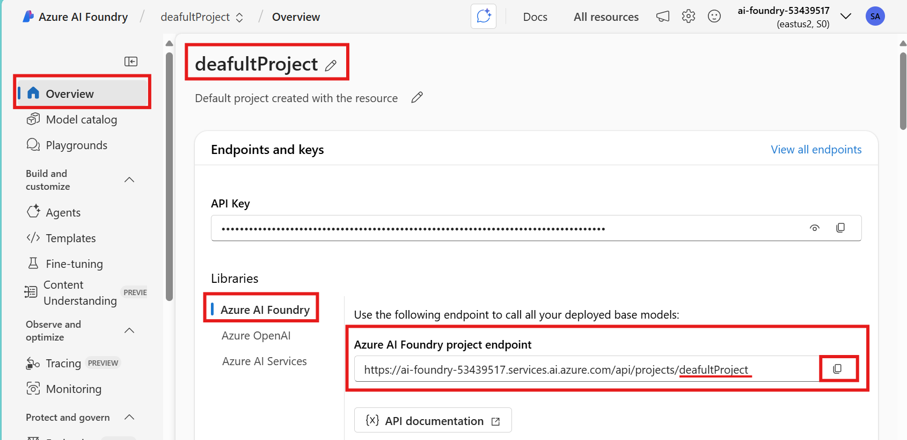
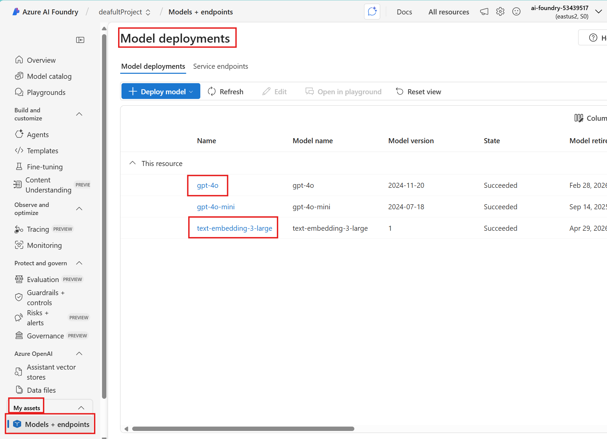
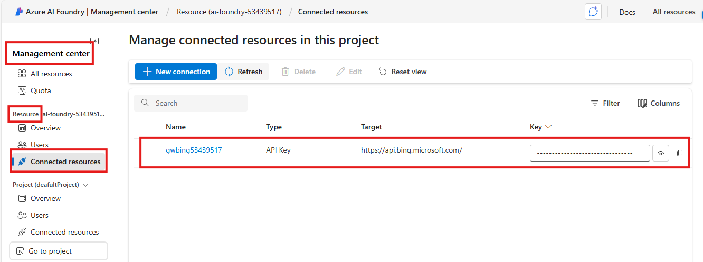
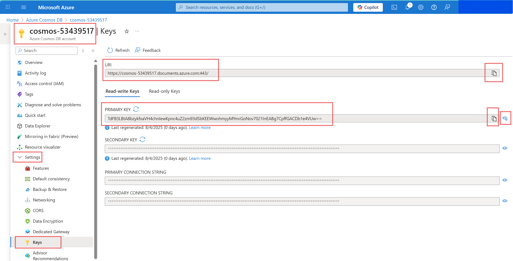

# Setup .env file

## Introduction 

This lab walks you through the steps to setup the .env file as a mandatory step for getting ready for executing the LAB exercises. Note that while this .env file can be setup in a code-first approach using REST API or SDKS, this LAB wants you to do the setup in an interactive way for a learning experiece. 

## Objectives 
In this lab we will:
-	Setup the .env file that will be leveraged to execute the lab exercises

## Estimated Time 

15 minutes 

## Scenario
Setup the .env file that will be leveraged to execute the lab exercises as an interactive way for a learning experience

## Pre-requisites
Complete the prerequisites Lab exercises
- [Create Azure AI Foundry Project](01-Create-Azure-Foundry-Project.md)
- [Deploy models into the Azure AI Foundry Project](02-Deploy-Models.md)
- [Create connections to Bing Resources at Azure AI Foundry resource level](03-Connect-to-Bing-Resources.md)
- [Create connections to Azure AI Search at AI Foundry resource level](04-Connect-to-Azure-AI-Search.md)

## 🛠️ Tasks

### 1. Copy .env.example as .env
- Find the .env.example file that is supplied as the template. You can find it in the root folder provided within the lab VM

- Copy .env.example to save as .env in the same folder location
- Edit .env to provide the actual value from your environment by following the steps
- Do not modify the section that is marked for not to modify

### 2. Go to the default Project

- Go to [https://ai.azure.com](https://ai.azure.com/) and sign in with your Azure credentials.
- Click **Azure AI Foundry** at the top left
- Click Your AI Foundry (eg ai-foundry-53439517)

### 3. Set value for PROJECT_CONNECTION_STRING, AZURE_PROJECT_NAME

- At  the center of the **Overview** section, you can find the Azure AI Foundry project endpoint as shown below
- Copy and paste into .env file as the value for PROJECT_CONNECTION_STRING

-
- Copy and paste into .env file the project name. Project name is the last part of the endpoint string after the "/" (eg. defaultProject)

### 4. Set value for AZURE_OPENAI_ENDPOINT, AZURE_OPENAI_API_KEY and more

- Scroll to the bottom on the left side menu
- Click **Models + endpoints** in the My assets section 
- You can view list of Model deployments on the right side
- Click on each name to get details

- As shown in the screenshot Copy Endpoint Target URI and paste into .env file as the value for AZURE_OPENAI_ENDPOINT
- Copy Key and paste into .env file as the value for AZURE_OPENAI_API_KEY

- The Endpoint Target URI is in the form of https://<AI-FOUNDRY-NAME>.cognitiveservices.azure.com/openai/deployments/<MODEL-DEPLOYMENT-NAME>/chat/completions?api-version=<MODEL-API-VERSION>
- Copy corresponding string from the URI and paste into .env file as the value for MODEL_DEPLOYMENT_NAME and MODEL_API_VERSION

### 5. Set value for AZURE_OPENAI_EMBEDDING_ENDPOINT and more

- Similar steps as above 
- Click on embeddding model name to get details
- As shown in the screenshot Copy Endpoint Target URI and paste into .env file as the value for AZURE_OPENAI_ENDPOINT
- Copy Key and paste into .env file as the value for AZURE_OPENAI_EMBEDDING_API_KEY

- The Endpoint Target URI is in the form of https://<AI-FOUNDRY-NAME>.cognitiveservices.azure.com/openai/deployments/<MODEL-DEPLOYMENT-NAME>/chat/completions?api-version=<MODEL-API-VERSION>
- Copy corresponding string from the URI and paste into .env file as the value for EMBEDDING_MODEL_DEPLOYMENT_NAME and EMBEDDING_MODEL_API_VERSION

### 6. Set value for GROUNDING_WITH_BING_CONNECTION_NAME

- At the top left, Click **Azure AI Foundry**
- Click Your AI Foundry (eg ai-foundry-53439517)

- Left side, in the **Management center**, in the Resource section, Click **Connected resources**
- You can see list of connected resources

- Copy the "Name" of the "Grounding with Bing Search" connection (Corresponding Target columns is https://api.bing.microsoft.com/) and paste into .env file as the value for GROUNDING_WITH_BING_CONNECTION_NAME

### 7. Set value for TENANT_ID

- Go to [https://portal.azure.com](https://portal.azure.com) and sign into the Azure portal with your Azure credentials.
- In the top search bar, type **entra id**
- Select **Microsoft Entra ID** from the search results

- In the Overview section, find **Tenant ID** as shown in the screenshot
- Copy Tenant ID and paste into .env file as the value for TENANT_ID

### 8. Set value for AZURE_AI_SEARCH_ENDPOINT & AZURE_AI_SEARCH_API_KEY

- In the top search bar, type **ai search**
- Select **AI Search** from the search results
- You will see the AI Search service that you have created (eg ai-search-53439517)
- Click on the name
- Next screen, In the Overview section, find the **Url** as shown in below screenshot
- Copy and paste into .env file as the value for AZURE_AI_SEARCH_ENDPOINT

- On the left side Menu, expand **Settings**
- Click **Keys**
- Copy the key as shown in the screenshot for this Lab, and paste into .env file as the value for AZURE_AI_SEARCH_API_KEY

### 9. Set value for COSMOS_ENDPOINT & COSMOS_KEY

- In the top search bar, type **cosmos**
- Select **Azure Cosmos DB** from the search results
- You will see the Azure Cosmos DB that you have created (eg cosmos-53439517)
- Click on the name
- Next screen, at the left side, expand **Settings**, Click **Keys**
- Copy **URI** and paste into .env file as the value for COSMOS_ENDPOINT
- Toggle the eye icon at the far right of **PRIMARY KEY**, Copy the key and paste into .env file as the value for COSMOS_KEY

### 10. Set value for SQL_SERVER

- In the top search bar, type **sql**
- Select **SQL Servers** from the search results
- You will see the SQL Server that you have created (eg sqlserver-53439517)
- Click on the name
- Next screen, in the **Overview** section, Copy **Server Name** and paste into .env file as the value for SQL_SERVER

## ✅ Completed. 
- You should have the .env setup complete.

