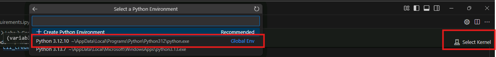

# Run requirements file to install the relevant packages

## Introduction 

This lab walks you through the installation of the required packages needed to run the rest of the lab

## Objectives 
In this lab we will:
-	Install the required packages needed to run the rest of the lab.

## Estimated Time 

5 minutes 

## Scenario
Install the required packages needed to run the rest of the lab.

## Pre-requisites
No Pre-requisites

## 🛠️ Tasks

### 1. Launch the Visual Studio Code
- Launch the Visual Studio Code in the LAB VM.
- Open the LABS folder, if not opened already
- Select **06-pip-install-requirements.ipynb** to open the notebook
- **Select kernel** on the right top side of the notebook
- Select **Python 3.12.10** for this LAB

- run the contents of the file. 
