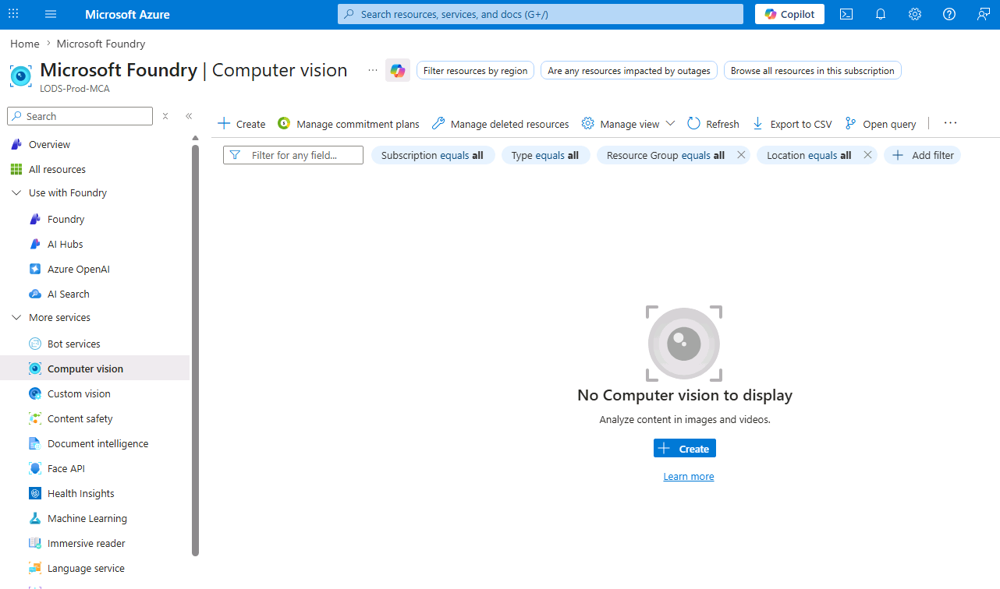
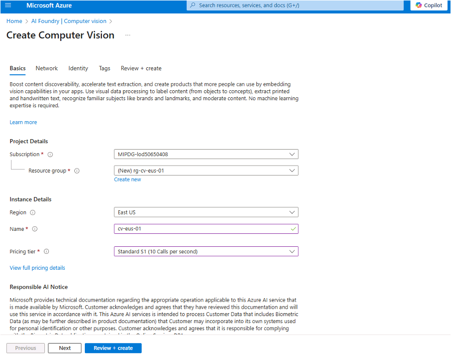
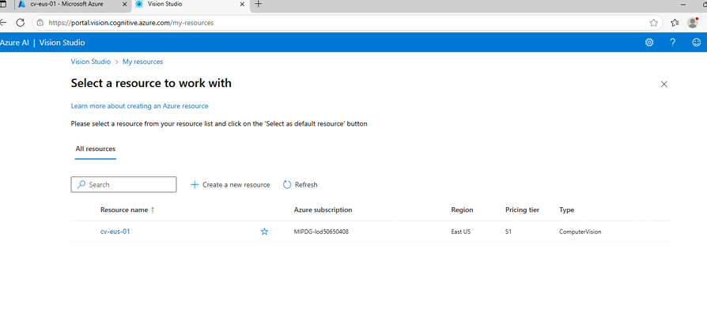
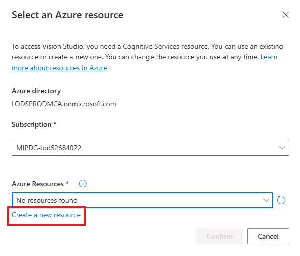
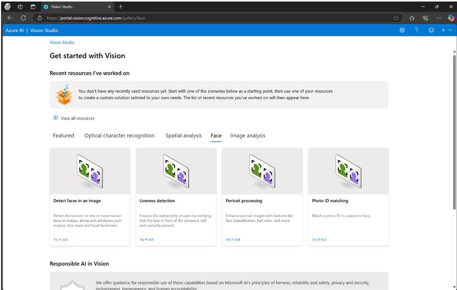
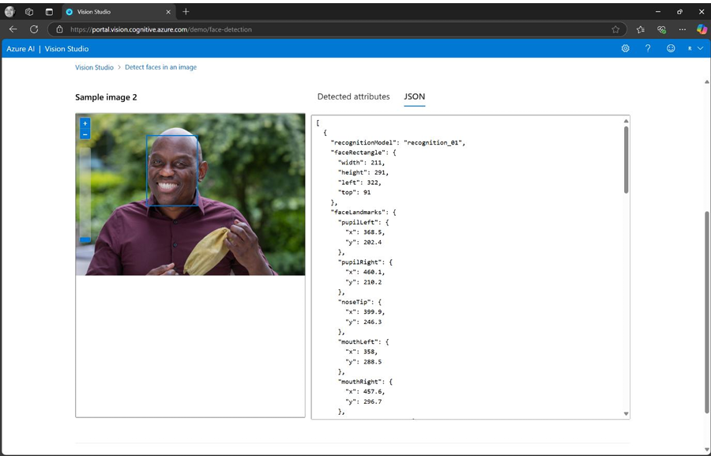

# Azure AI Vision – Lab

## Introduction

Azure AI Vision is a cloud-based service from Microsoft that uses advanced algorithms to analyze images and extract valuable information. It includes capabilities like face detection, Optical Character Recognition (OCR), image analysis, and video indexing.

> **Note:** The Azure Vision Studio portal now only displays the **Face** feature. OCR, Image Analysis, and Video Indexer capabilities are still accessible through their respective **SDKs and REST APIs**. This lab covers Face Analysis through the portal and provides SDK/API-based exercises for the other services via the accompanying notebook.

## Objectives

In this lab we will walk through:
- Face Analysis (via Vision Studio portal)
- OCR (via SDK/API)
- Image Analysis (via SDK/API)
- Video Indexer (via API)

## Estimated Time

30 minutes

## Scenario

Explore Azure AI Vision services: use the Vision Studio portal for Face Analysis, and the SDK/REST APIs for OCR, Image Analysis, and Video Indexer.

## Pre-requisites

Complete the pre-requisite instructions.

## Tasks

---

## Exercise 1: Provision Azure Resources

1. Access the Azure portal (portal.azure.com) and create a Computer Vision resource. +++**cv-@lab.LabInstance.Id**+++ (eg cv-53439517) Ensure to use this name, you will not be able to use a different name to create the resource. The screen shot provided here is just for reference, do not use the name provided in the screenshot below. Select **S1** as SKU. .
2. Ensure the resource is created in a supported region. 
3. Access Vision Studio at [https://portal.vision.cognitive.azure.com/](https://portal.vision.cognitive.azure.com/) and select your resource. 

---

## Exercise 2: Face Analysis

This exercise demonstrates how to use Azure AI Vision, Face to detect and analyse human faces in images. Navigate to [Azure AI | Vision Studio](https://portal.vision.cognitive.azure.com/), log in with your Azure credentials, and then click on the "Face" tab. Note that you may need to create a resource to access. Use this name for Face Vision resource. +++**faceresource-@lab.LabInstance.Id**+++ (eg faceresource-53439517). Ensure to use this name, you will not be able to use a different name to create the resource. The screen shot provided here is just for reference, do not use the name provided in the screenshot below. Choose **S0** SKU

01. Iteratively click the samples to the right of the box.

In order to try the Face liveness detection, feature you need to apply access for the service from your subscription. For the purpose of this lab, you may skip this but have this as an option when you work on your organizational subscription.

---

## Exercise 3: Optical Character Recognition (OCR) via SDK/API

> :warning: **Deprecation Notice:** The Image Analysis 4.0 OCR service is deprecated and will be **retired on September 25, 2028**. Legacy Computer Vision API versions (v1.0-v3.1) will be **retired on September 13, 2026**. Consider migrating to:
> - [Azure AI Document Intelligence - Read model](https://learn.microsoft.com/azure/ai-services/document-intelligence/prebuilt/read) (optimized for documents)
> - [Azure Content Understanding](https://learn.microsoft.com/azure/ai-services/content-understanding/overview) (managed generative solution)

While the OCR feature is no longer available in the Vision Studio portal, the **REST API and SDKs** remain fully functional until the retirement dates above.

The OCR API extracts printed and handwritten text from images such as posters, street signs, product labels, business documents, invoices, and receipts. It supports multiple languages and works with text on various surfaces and backgrounds.

**Hands-on exercise:** Open the notebook at [`LabFiles/AI_vision_services_lab.ipynb`](./LabFiles/AI_vision_services_lab.ipynb) and complete **Section 02 - Extract Text from Images** to call the OCR API programmatically.

---

## Exercise 4: Image Analysis via SDK/API

> :warning: **Deprecation Notice:** The Image Analysis 4.0 service is deprecated and will be **retired on September 25, 2028**. Consider migrating to:
> - [GPT models in Microsoft Foundry](https://learn.microsoft.com/azure/ai-foundry/concepts/foundry-models-overview) (flexible custom vision solutions)
> - [Azure Content Understanding](https://learn.microsoft.com/azure/ai-services/content-understanding/overview) (managed generative solution for images, documents, audio, and video)

While Image Analysis is no longer available in the Vision Studio portal, the **REST API and SDKs** remain fully functional until the retirement date above.

The Image Analysis API provides capabilities including:
- **Caption generation** - Generate natural language descriptions of images
- **Dense captions** - Detailed captions for multiple regions within an image
- **Tagging** - Extract common tags and objects detected in images
- **Smart cropping** - Intelligently crop images around areas of interest
- **Image retrieval** - Search photos using natural language queries

**Hands-on exercise:** Open the notebook at [`LabFiles/AI_vision_services_lab.ipynb`](./LabFiles/AI_vision_services_lab.ipynb) and complete **Sections 03-07** (Image Retrieval, Dense Captions, Captions, Tags, Smart Crop) to explore these capabilities via the API.

---

## Exercise 5: Video Indexer via API

Azure AI Video Indexer is a cloud-based service that extracts insights from videos using AI models for speech, vision, and natural language processing. The service is **actively supported** with no announced retirement date.

> **Note:** Azure Media Services (AMS)-based Video Indexer accounts were retired in June 2024. All new accounts are AMS-less. If migrating from an older account, see the [AMS migration guide](https://learn.microsoft.com/azure/azure-video-indexer/create-account).

The Video Indexer API enables you to:
- Upload and index videos programmatically
- Extract insights including people detection, topics, keywords, labels, named entities, and scenes
- Generate transcriptions, captions, and multi-modal video summaries
- Perform face redaction and object detection

**Hands-on exercise:** Open the notebook at [`LabFiles/AI_vision_services_lab.ipynb`](./LabFiles/AI_vision_services_lab.ipynb) and complete **Section 08 - Video Indexer** to upload and index a video via the API.

---
