# Title of the lab

## Introduction 

This lab shows <provide intro>.

## Objectives 
 List the objectives
In this lab we will:
-	

## Estimated Time 

30 minutes 

## Scenario

## Pre-requisites

## Tasks

# Azure AI Vision Lab Instructions – Low Code Lab

Azure AI Vision is a cloud-based service from Microsoft that uses advanced algorithms to analyze images and extract valuable information. It includes capabilities like Optical Character Recognition (OCR), face detection, image analysis, and video indexing. This lab guides you through low-code exercises.

---

## Exercise 1: Provision Azure Resources
1. Access the Azure portal and create a Computer Vision resource. 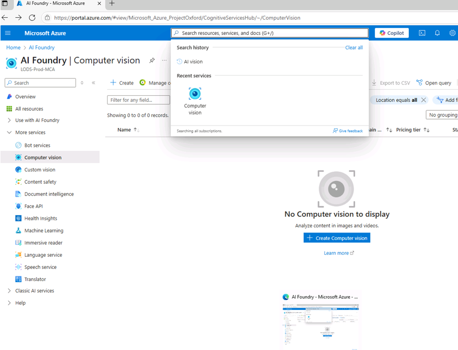
2. Ensure the resource is created in a supported region. 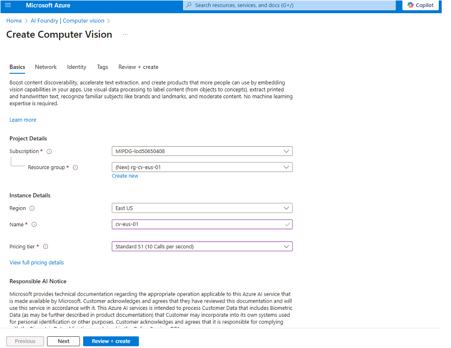
3. Access Vision Studio at [https://portal.vision.cognitive.azure.com/](https://portal.vision.cognitive.azure.com/) and select your resource. 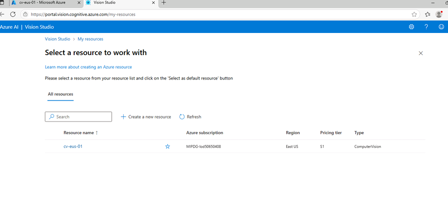

---

## Exercise 2: Optical Character Recognition (OCR)
1. Go to [Azure AI Vision Studio](https://portal.vision.cognitive.azure.com/), log in, and select the "Optical character recognition" tab.  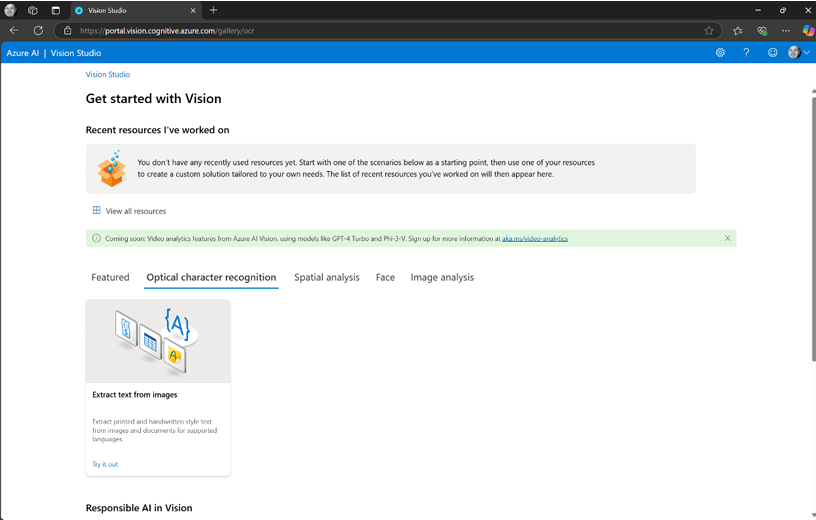
2. Click "Extract text from images."  
3. Browse for a file and select your AI vision resource. 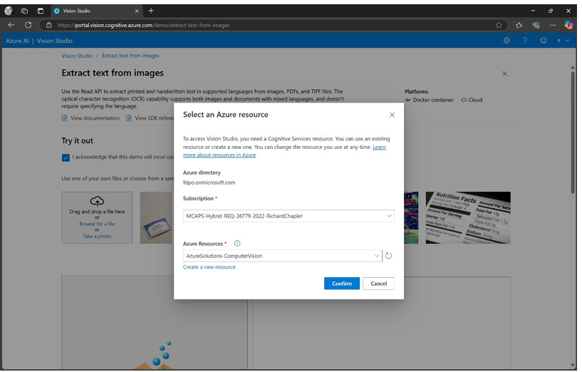
4. Review results on the “Detected attributes/JSON” tabs. 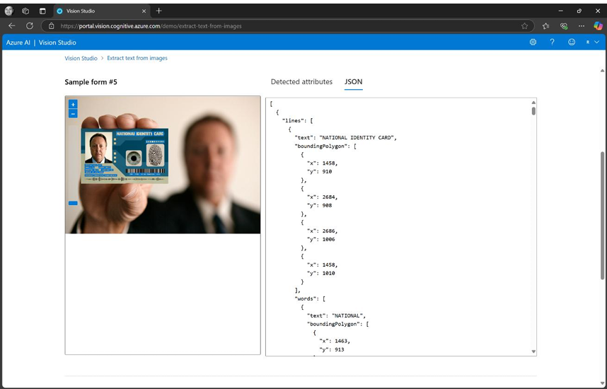

---

## Exercise 3: Face Analysis
This exercise demonstrates how to use Azure AI Vision, Face to detect and analyse human faces in images. Navigate to [Azure AI | Vision Studio](https://portal.vision.cognitive.azure.com/), log in with your Azure 
credentials, and then click on the "Face" tab. 
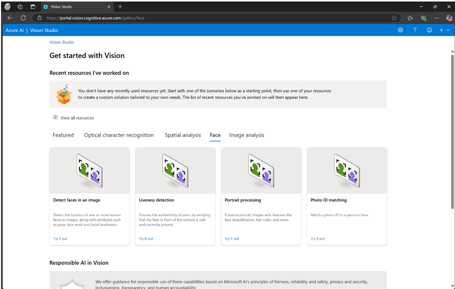
01. Iteratively click the samples to the right of the box.  

In order to try the Face liveness detection, feature you need to apply access for the service from your subscription.  

---

## Exercise 4: Image Analysis
This exercise demonstrates how to use Azure AI Vision, Image Analysis to extract meaningful insights from images, including object detection, caption generation, and scene understanding. 
Navigate to [Azure AI | Vision Studio](https://portal.vision.cognitive.azure.com/), log in with your Azure credentials
1. In Vision Studio, select the "Image analysis" tab.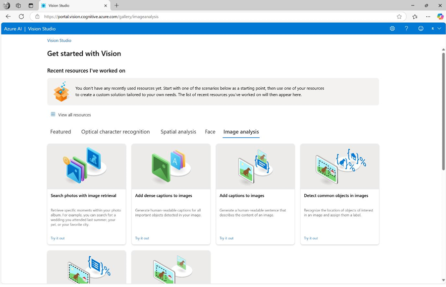
2. Search photos with image retrieval. 
3. Enter a natural language query to retrieve relevant images. 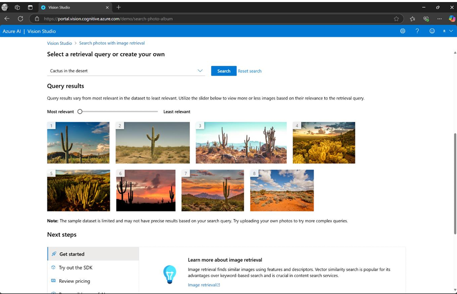
4. Try generating dense captions for images.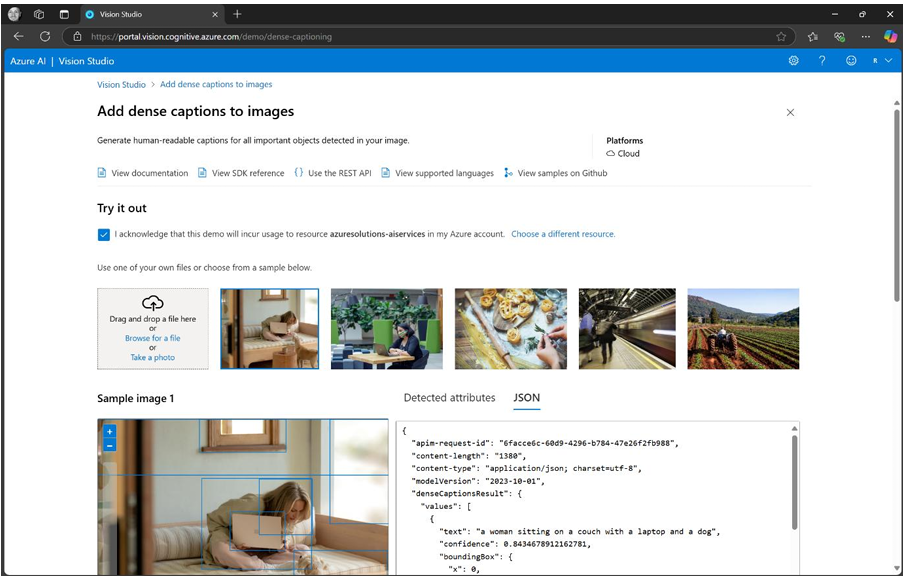
5. Extract common tags by choosing the model, language, and clicking samples. 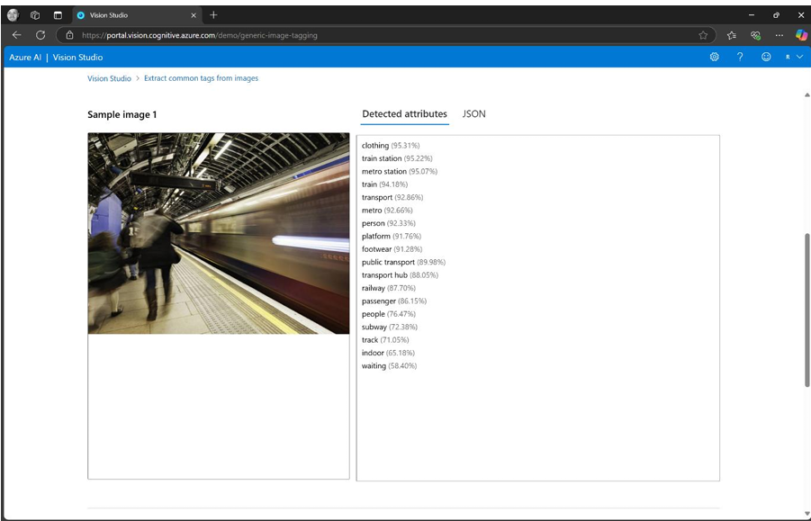

---

## Exercise 5: Video Indexer
1. Go to [Azure AI Video Indexer](https://www.videoindexer.ai/account/login) and log in. 
2. Complete the "Use of facial identification and recognition" form and accept.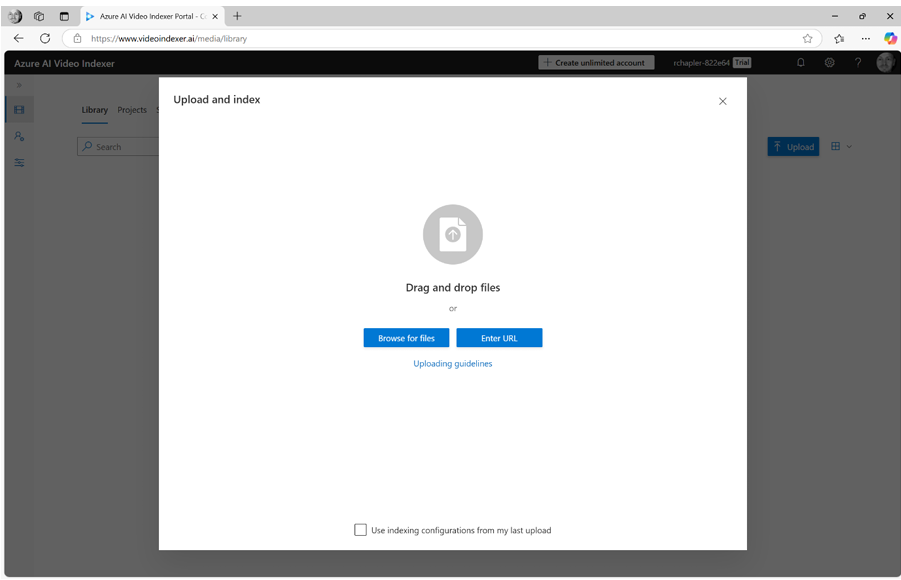
3. Click "Upload," then "Browse for files" to select a video.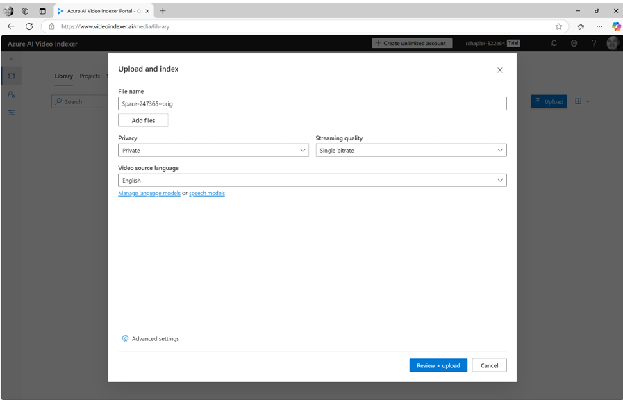
4. Complete the upload form (file name, privacy, streaming quality, language, etc.).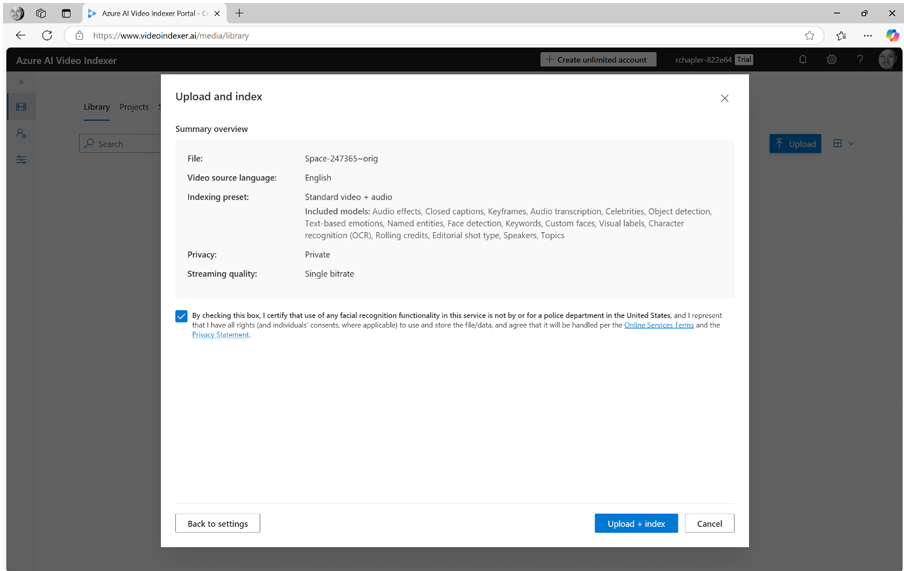
5. Click "Review + upload," then "Upload + index."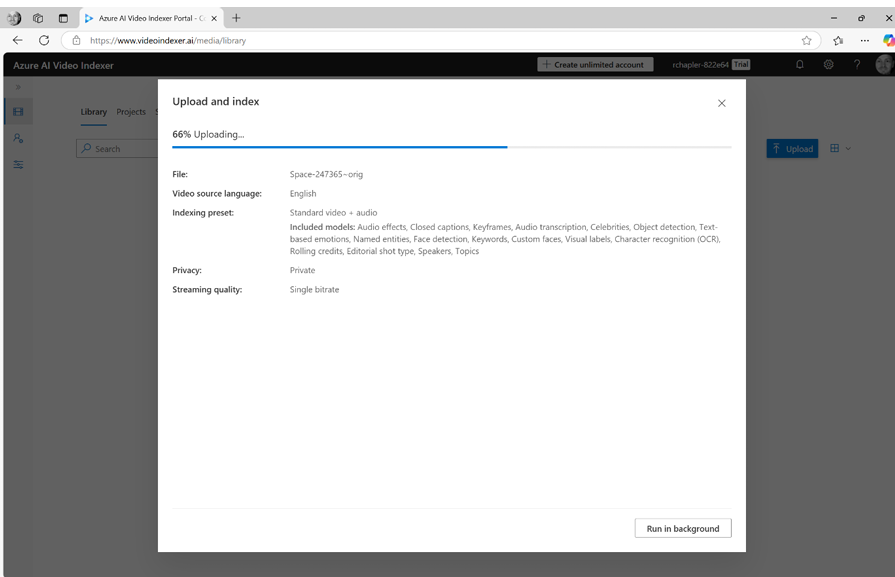
6. Monitor progress; you'll receive an email when processing is complete. 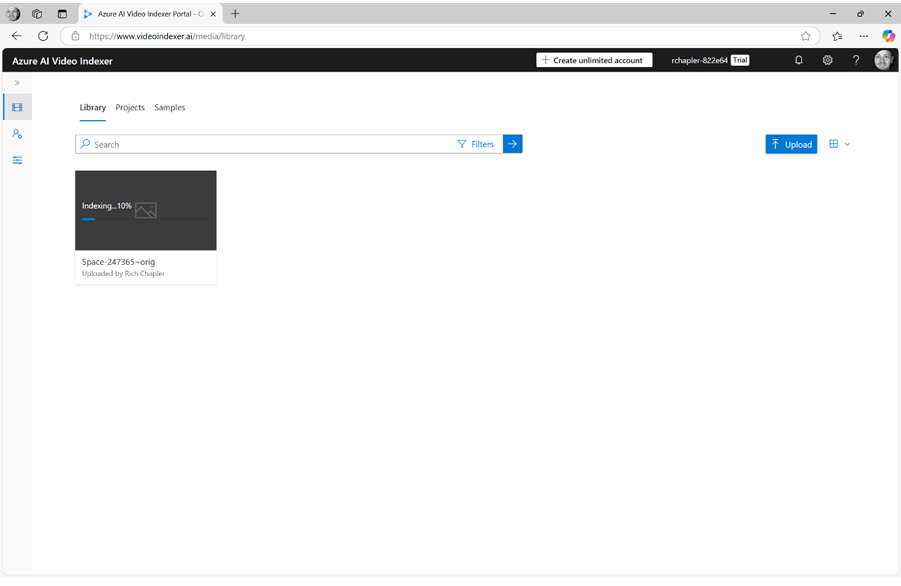. For the purpose of this lab, there won't be an email, so this step may not work for this lab environment. 
7. Click "Watch now >" in the email or view the video in the Video Indexer interface. 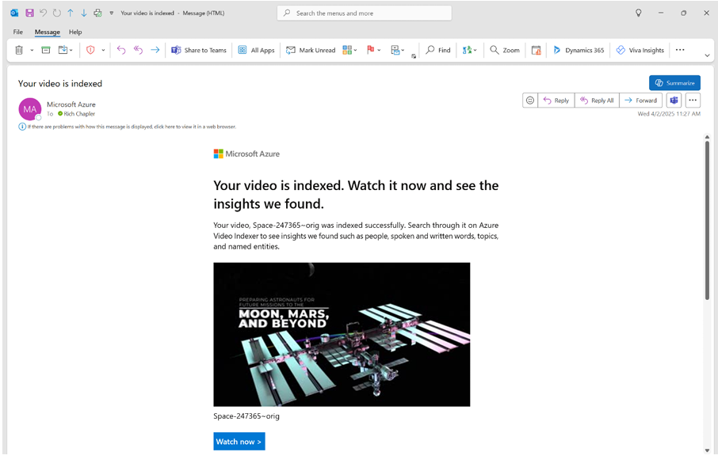
8. Review video insights: playback area, insights panel (person, topic, keywords, labels, named entities, scenes).

---

For pro-code labs, follow the instructions in the provided Jupyter notebook.
