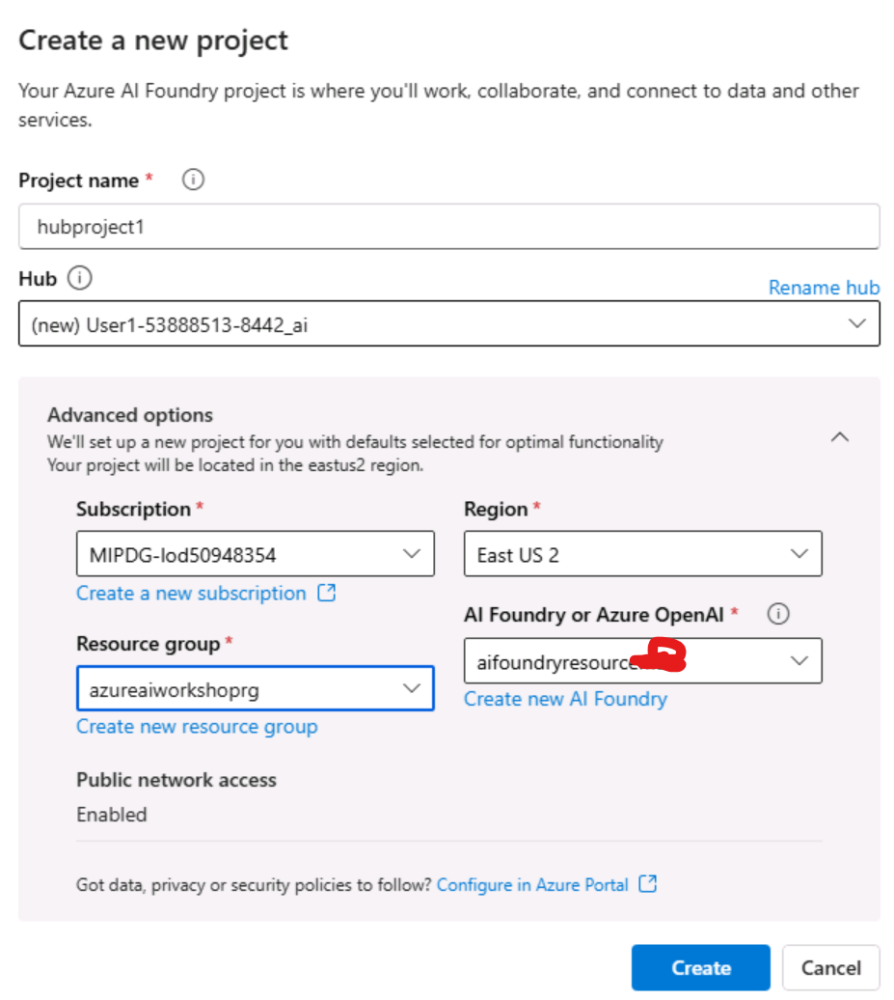
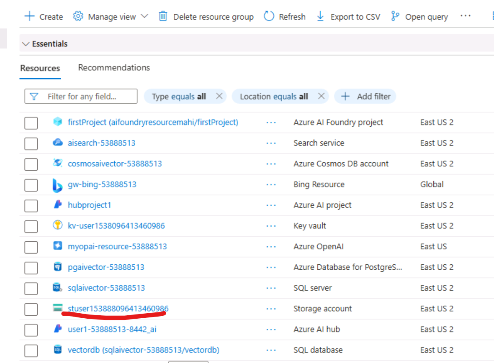
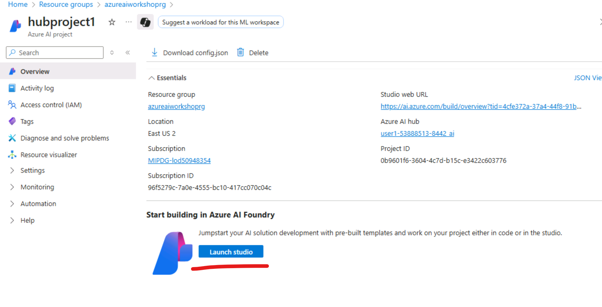
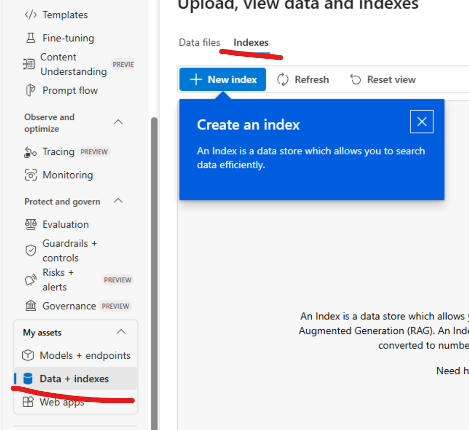
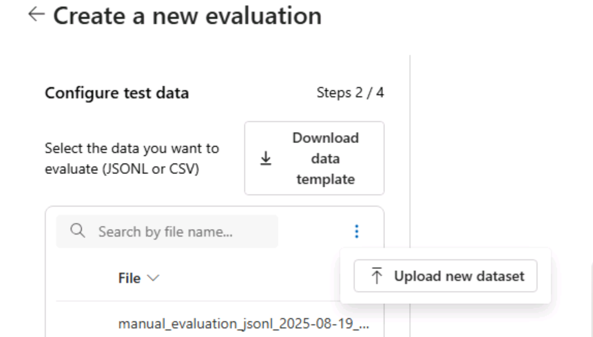
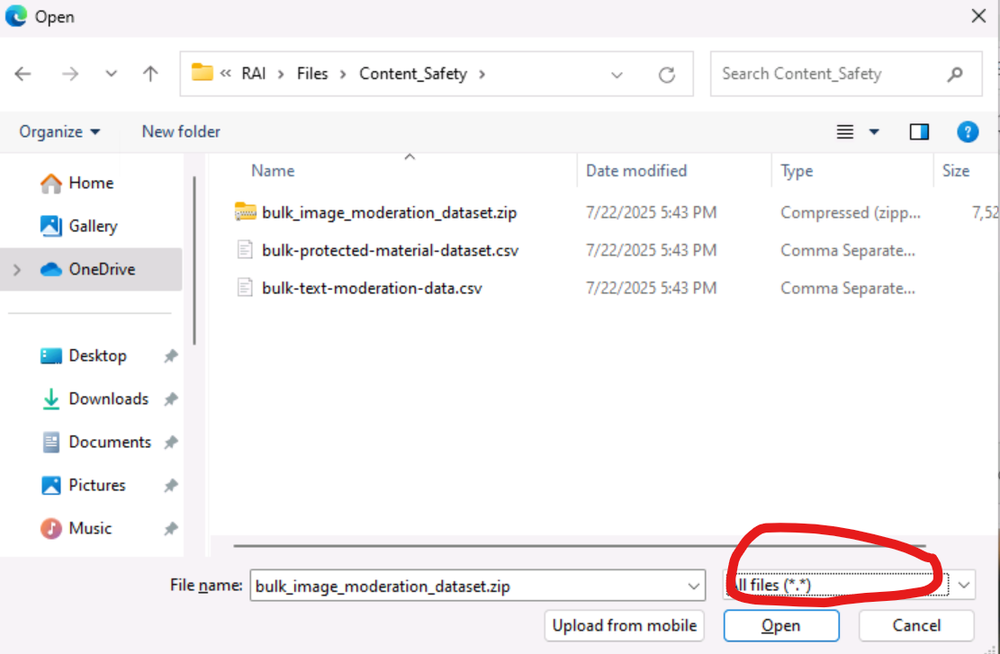

# Responsible AI

## Introduction 

This lab shows walks through Evaluations, Content Safety, PII Detection and Masking.

## Objectives 
In this lab we will explore the following:
- [Evaluations](#evaluations)
- [Manual Evaluation](#manual-evaluation)
- [Automated Evaluation](#automated-evaluation)
- [Content Safety](#content-safety)
- [PII Detection and Masking](#pii-detection-and-masking)
- [System Message](#system-message)	

## Estimated Time 

45 minutes 

## Scenario
Test Evaluations(manual, automated, content safety, PII Detectionand Masking, System Message)

## Pre-requisites
Completed the pre-requisites labs
- Create Azure AI Foundry Project
- Deploy models into the Azure AI Foundry Project
- Create connections to Bing Resources at Azure AI Foundry resource level
- Create connections to Azure AI Search at AI Foundry resource level

## Tasks

## Evaluations

**Setup** 

Setup is already done with pre-requisite AI Foundry Creation Lab. Follow the steps below to specifically create hub resource for this lab.

1. **Create Azure AI Foundry Hub Project**
   - Go to [https://ai.azure.com](https://ai.azure.com/) and sign in with your Azure credentials.
   - Click **Azure AI Foundry** at the top left
   - Click Your AI Foundry
   - Create a new hub in a region like *France Central*.
   
   - Click on Advanced and remember to use the existing resource group pre-created for this lab VM
   
   
    - Click **Create** Ensure the hub is created successfully.

2. **Upload Files**
    - Go to the resource group **azureaiworkshoprg** and Launch the Azure AI Foundry.
    - Go to the resource group and find the storage account that was created.
    
    - Access it and find the container ending in `-azureml-blobstore`.
    - First create a new directory and name it **Contoso** in the container and upload the contents of C:\Users\Admin\Desktop\Labs\RAI
    
    

3. **Connect Azure AI Search**
    - On the left side, go to **Management center** at the bottom.
    - Underneath **Hub** (*your-hub-name*), select **Connected resources**.
    - Click **New connection**.
    - Choose **Azure AI Search**.
    - Search for the Search resource you created at the beginning of this module and select **Add Connection** from the right side.
    - Once you see the green checkmark with **Connected**, you can press **Close**.

4. **Create Index**
    - Launch the project from portal 
    
    - In the **Data + indexes** section, select **Indexes** from the top menu.
    
    - Click **New index**.
    - For **Data source**, choose **Azure Blob Storage**.
    - Select the blob store named `workspaceblobstore`.
    - Choose the folder you uploaded earlier (e.g., `Contoso`).
    - Click **Next**.
    - Select the Azure AI Search Service connected to your hub from the drop-down list.
    - Leave the remaining settings as default and click **Next**.
    - Ensure the AOAI connection is the one associated with this Hub (set up in the previous step).
    - Set the **Embedding model** to `text-embedding-3-large`.
    - Confirm that the **Embedding model deployment** is also set to `text-embedding-3-large` (or matches the deployment name you used earlier).
    - Click **Next**.
    - Click **Create vector index**.

### Manual Evaluation

1. On the left side, go to the **Protect and govern** section.
2. Select **Evaluation**.
3. At the top, choose **Manual evaluations**.

    

4. Select **New Manual Evaluation**. Under Configurations, see the options.
5. On the right, select the model you deployed (e.g., `gpt-4o`).
6. Still on the right, click **Add your data** and select the index you just created. Note that this may take some time. Check if the index is in **ready** state and not in **running** 
7. At the bottom of the page, select **Import test data**.
8. Click **Upload dataset** and upload the file from `C:/Users/Admin/Desktop/Labs/RAI/Files/Evaluations/manual_evaluation.jsonl`.
9. In the **Map data** pane, scroll down and set:
    - **Input** = `chat_input`
    - **Expected response** = `truth_value`
10. Press **Add**.
11. Press **Run**.
12. Review each result and use the thumbs up or thumbs down icons on the right side of each result.
13. Explore the results. Consider adjusting the **Temperature** or **Search type** to compare different outcomes.
14. Save your results if you want to compare different iterations.

### Automated Evaluation

1. On the left side, go to the **Protect and govern** section.
2. Select **Evaluation**.
3. At the top, select **Automated evaluations**.

    

4. Click **Create a new Evaluation**.
5. Choose **Evaluate an existing query-response dataset** and press **Next**.
6. Select **Upload new dataset**.
 
7. Open the folder `C:/Users/Admin/Desktop/Labs/RAI/Files/Evaluations` and select the `automated_evaluation.jsonl` file.
8. Press **Next** to add evaluators.
9. In the **AI Quality** section, select **Likert-scale evaluator**:
    - Choose **Groundedness**.
    - Ensure the selected model is the previously deployed model.
    - For **context**, select `item.context`.
    - For **query**, select `item.chat_input`.
    - For **response**, select `item.truth`.
    - Press **Add**.
10. Again in **AI Quality**, select **Likert-scale evaluator**:
    - Choose **Relevance**.
    - Ensure the selected model is the previously deployed model.
    - For **query**, select `item.chat_input`.
    - For **response**, select `item.truth`.
    - Press **Add**.
11. Repeat the previous step to add **Coherence** and **Fluency** evaluations using the Likert-scale evaluator.
12. In the **Ensure safe and ethical content** section, select **Violent content**:
    - For **query**, select `item.chat_input`.
    - For **response**, select `item.truth`.
13. Repeat the previous step for the following evaluations in the **Ensure safe and ethical content** section:
    - **Hateful and unfair content**
    - **Self-harm-related content**
    - **Sexual content**
    - **Protected material**
    - **Indirect attack**
14. Press **Next** and then **Submit**.
15. Wait for the evaluation to finish.
16. You can find the results in **Protect and govern** → **Evaluation** → **Automated evaluations**. Click the evaluation title to explore the results.
    - *Tip 1:* Try both the **Report** and **Data** tabs at the top.
    - *Tip 2:* Modify the dataset to see how the evaluation results change.

## Content Safety

**Moderate Text Content**  
1. Return to the resource group, select the AI project, and launch the studio.  
2. On the left, select **AI Services**.  
3. On the right, choose **Content Safety**.  
4. Under **Filter text content**, select **Moderate text content**.  
5. Ensure the Azure AI Services resource is your Foundry instance.  
6. You can test with a simple test first:  
    a. Press one of the samples offered.  
    b. Scroll down and press **Run test**.  
    c. Scroll down and view the results.  
    d. You can experiment further by configuring the content filters on the right, **modifying the blocklist**, or **changing the prompt**.  
7. For bulk testing, select **Run a bulk test**, upload ``C:/Users/Admin/Desktop/Labs/RAI/Files/Content_Safety/bulk-text-moderation-data.csv`, and run the test.  
8. Explore results and adjust filters or datasets as needed.

**Detect Protected Material**  
1. In the Content Safety tab, select **Protected material detection for text**.  
2. Ensure the correct Azure AI Services resource is selected.  
3. Run a simple test and view results.  
4. For bulk testing, select **Run a bulk test**, upload `C:/Users/Admin/Desktop/Labs/RAI/Files/Content_Safety/bulk-protected-material-dataset.csv`, and run the test.  
5. Explore the results.

**Moderate Image Content**  
1. In the Content Safety tab, under **Filter image content**, select **Moderate image content**.  
    **Note:**  Some sample content may be offensive.
2. Ensure the correct Azure AI Services resource is selected.  
3. You can test with a simple test first:  
    a. Press one of the samples offered.  
    b. Scroll down and press **Run test**.  
    c. Scroll down and view the results.  
    d. You can experiment further by configuring the **content filters** and their **thresholds** on the right.  
4. For bulk testing, select **Run a bulk test**, upload ``C:/Users/Admin/Desktop/Labs/RAI/Files/Content_Safety/bulk_image_moderation_dataset.zip` (no need to decompress), and run the test. You may need to select **All files** for the .zip file to show up. 

5. Explore results and adjust filters or datasets as needed.

## PII Detection and Masking

1. Go to the resource group.
2. Identify the Azure AI project service and access it.
3. Press **Launch Studio**.
4. On the left side, select **Playgrounds**.
5. Scroll down and select **Try the Language playground** from the Language playground card.
6. Ensure the **Connected to resource** at the top is the resource you created for this lab.
7. If not already selected, scroll to the right on the carousel and select **Extract PII from text**.
8. In the middle pane, either paste your own text to analyze or use one of the available samples (e.g., Legal (NDA)).
9. Press **Run**.
10. Observe the results and review the **Details** section on the right.
11. Press the **Hide PII** slider above the evaluated text.
12. Explore with different samples and configurations from the left pane.
    - *Note:* To modify a sample, press the **Edit** (crayon) icon next to the Hide PII button.

## System Message

Under the Playground, go to Agents Playground by clicking on **Try the Agents Playground** The instructions below givean idea of how to provide instructions to the agent before chatting with it. Step 1-5 below are informational to give an idea of how system prompt will look like.

**1. Define the Purpose of the AI Agent**

Clearly state what the AI agent is designed to do, including:
- **Domain:** (e.g., customer support, sales assistant, internal IT helpdesk)
- **Audience:** (e.g., end users, developers, executives)
- **Expected Outcomes:** (e.g., answer questions, generate reports, summarize documents)

**Example:**  
"This AI agent assists enterprise users with Azure-related technical queries and provides step-by-step troubleshooting guidance."

**2. Set the Role and Identity of the AI**

Define how the AI should present itself:
- **Name:** (if applicable)
- **Role:** (e.g., assistant, advisor, coach)
- **Tone:** (e.g., professional, friendly, concise)

**Example:**  
"You are AzureBot, a helpful and knowledgeable assistant for Azure developers. You speak in a professional yet approachable tone."

**3. Specify Capabilities and Limitations**

Outline what the AI can and cannot do to manage expectations and ensure safe, accurate responses.

**Example:**  
- You can answer questions about Azure services, pricing, and architecture.
- You cannot provide legal, financial, or medical advice.
- You must not generate code that modifies production environments without user confirmation.

**4. Define Behavioral Guidelines**

Provide instructions for handling different scenarios:
- How to handle ambiguous queries
- How to respond to inappropriate requests
- How to escalate or defer when unsure

**Example:**  
- If a query is unclear, ask clarifying questions.
- If a request is outside your scope, politely decline and suggest alternatives.

**5. Include Safety and Compliance Rules**

Ensure adherence to organizational policies, ethical guidelines, and compliance standards.

**Example:**  
- Do not store or share user data.
- Avoid generating content that could be offensive, biased, or discriminatory.
- Follow Microsoft Responsible AI principles.

**6. Test and Iterate**

After drafting the system message:
- Test with real prompts
- Observe AI behavior
- Refine the message based on feedback and edge cases

---
Use the example below to paste under the **instructions** for the agent and start chatting with the agent.

**Sample System Message Template**

You are AzureBot, a professional and friendly assistant for Azure developers. Your goal is to help users understand and use Azure services effectively.

**You can:**
- Answer questions about Azure services, pricing, and architecture
- Provide step-by-step troubleshooting guidance
- Generate sample code and templates

**You cannot:**
- Provide legal, financial, or medical advice
- Modify production environments without user confirmation

**Behavior:**
- Ask clarifying questions if the query is ambiguous
- Respond with empathy and professionalism
- Escalate or defer if unsure

## Prompt Shields

**Setup**

Follow these steps to use the Content Safety "Try it out" page:

1. Go to Azure AI Foundry and navigate to your project or hub.
2. Select the **Guardrails + controls** tab on the left navigation, then choose the **Try it out** button.

### Using Prompt Shields for User Input Risk Detection

The **Prompt Shields** panel allows you to test user input risk detection. This feature identifies prompts intended to provoke the Generative AI model into unsafe behaviors or to bypass the rules defined in the System Message. Such attacks may include complex role-play or subtle attempts to undermine safety measures.

To use Prompt Shields:

1. Select the **Prompt Shields** panel.
2. Choose a sample text provided on the page, or enter your own content for testing.
3. Select **Run test**. The service will return the risk flag and type for each sample.
