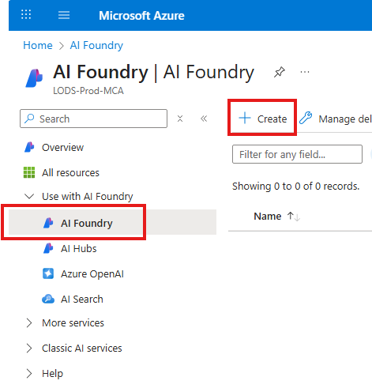
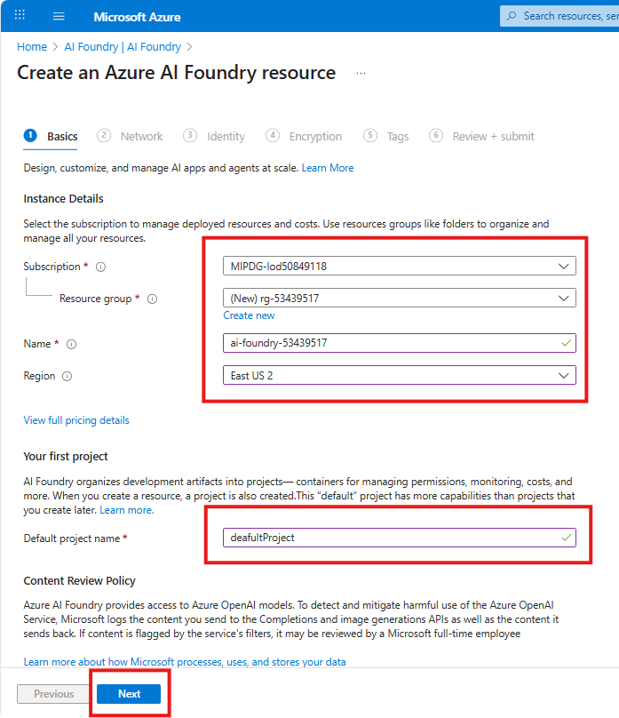
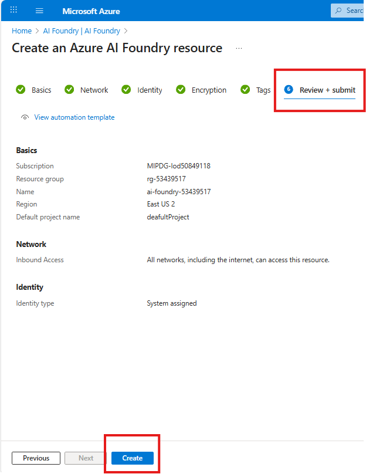

# Create Azure AI Foundry Project

## Introduction 

This lab walks you through the steps to create a **Azure AI Foundry** resource using the **Azure Portal**. This is a required setup step before proceeding with lab exercises involving AI Foundry capabilities.

### 💡 What is Azure AI Foundry
Azure AI Foundry is a unified platform for building, deploying, and managing enterprise-grade AI applications and agents—combining powerful tools, models, and infrastructure with built-in governance and scalability.

## Objectives 
 List the objectives
In this lab we will:
-	

## Estimated Time 

30 minutes 

## Scenario

## Pre-requisites

## 🛠️ Tasks

### 1. Sign in to Azure Portal

Go to [https://portal.azure.com](https://portal.azure.com) and sign in with your Azure credentials.

### 2. Search for "Azure AI Foundry"

- In the top search bar, type **"Azure AI Foundry"**
- Select **Azure AI Foundry** from the search results

### 3. Create "Azure AI Foundry"

- In the left side menu, expand **"Use with AI Foundry"**
- Select **AI Foundry**
- Click **+Create**

### 4. Fill in the details and deploy

- Choose the Subscription if not filled in automatically
- Choose the Resource Group if not filled in automatically (eg rg-53439517)
- Give a name for the Azure AI Foundry resource (eg ai-foundry-53439517)
- Choose a Region (eg East US 2)
- Give Deafult project name (eg deafultProject)
- Click **Next** button

- For this lab, Keep deafults for subsequents tabs (Network, Identity, Encryption, Tags) and Click **Next** button until **Review + submit**
- Click **Create** button
- In less than 2 minutes your deployment should complete

### 5. Verify Deployment

Once deployment is complete:

- Click **Go to resource**
- You should see the **Overview** details for the hub you just created.

## ✅ Completed

Once your Hub is created, you can access the hub many ways:
- Option 1: Azure Portal -> Azure AI Foundry -> AI Hubs -> Choose Your Hub
- Option 2: Go to [https://ai.azure.com](https://ai.azure.com) -> **Azure AI Foundry** at the top left -> "View all resources" -> Choose Your Hub

