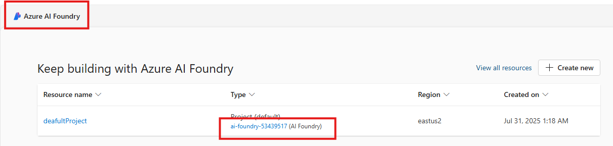

# Create connections to Azure AI Search at AI Foundry resource level

## Introduction 

This lab walks you through the steps to connect the Azure AI Search to the AI Foundry resource.

## Objectives 
In this lab we will:
-	Connect the Azure AI Search to the AI Foundry resource.

## Estimated Time 

30 minutes 

## Scenario
Connect the Azure AI Search to the AI Foundry resource.

## Pre-requisites
No Pre-requisites

## 🛠️ Tasks

### 1. Sign in to Azure AI Foundry portal

- Go to [https://ai.azure.com](https://ai.azure.com/) and sign in with your Azure credentials.
- Click **Azure AI Foundry** at the top left
- Click Your AI Foundry (eg ai-foundry-53439517)

### 2. Connected Resources

- Left side, in the **Management center**, in the Resource section, Click **Connected resources**

- Click **+New connection**
- Click **Azure AI Search**

- Review the name of the AI Search service
- Click **Add connection** on the right

- You can see the green tick at the right with Connected label
- Click **Close** button

## ✅ Completed. 

- Left side, in the **Management center**, in the Resource section, Click **Connected resources**
- You can see list of connected resources

