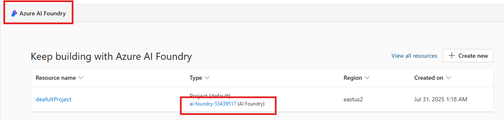
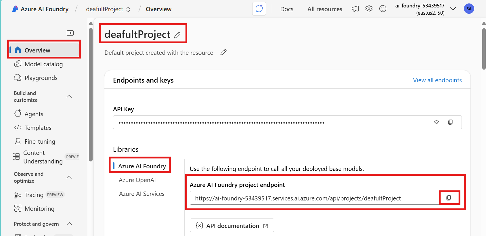

# Setup .env file

## Introduction 

This lab walks you through the steps to setup the .env file as a mandatory step for getting ready for executing the LAB exercises. Note that while this .env file can be setup in a code-first approach using REST API or SDKS, this LAB wants you to do the setup in an interactive way for a learning experiece. 

## Objectives 
 List the objectives
In this lab we will:
-	

## Estimated Time 

30 minutes 

## Scenario

## Pre-requisites

## 🛠️ Tasks

### 1. Copy .env.example as .env
- Find the .env.example file that is supplied as the template
- Copy .env.example to save as .env in the same folder location
- Edit .env to provide the actual value from your environment by following the steps
- Do not modify the section that is marked for not to modify

### 2. Go to the default Project

- Go to [https://ai.azure.com](https://ai.azure.com/) and sign in with your Azure credentials.
- Click **Azure AI Foundry** at the top left
- Click Your AI Foundry (eg ai-foundry-53439517)

### 3. Set value for PROJECT_ENDPOINT

- At  the center of the **Overview** section, you can find the Azure AI Foundry project endpoint as shown below
- Copy and paste into .env file as the value for PROJECT_ENDPOINT

## ✅ Completed. 

- WIP

