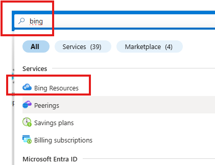
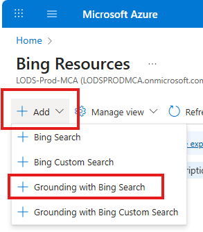
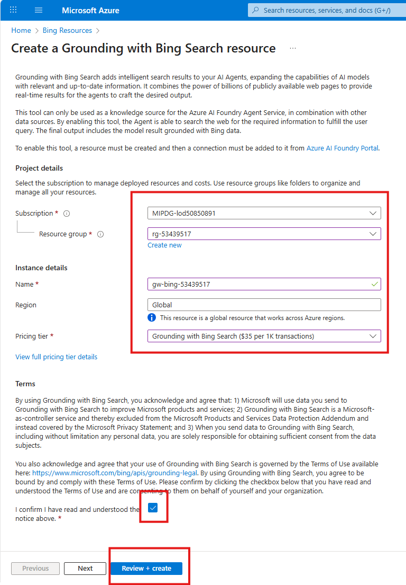
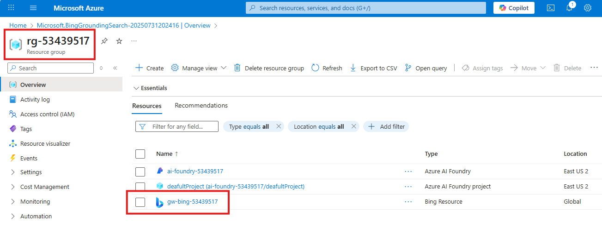

# Create Azure AI Foundry Project

## Introduction 

This lab walks you through the steps to create a **Azure AI Foundry** resource using the **Azure Portal**. This is a required setup step before proceeding with lab exercises involving AI Foundry capabilities.

### 💡 What is Azure AI Foundry
Azure AI Foundry is a unified platform for building, deploying, and managing enterprise-grade AI applications and agents—combining powerful tools, models, and infrastructure with built-in governance and scalability.

## Objectives 
 List the objectives
In this lab we will:
-	

## Estimated Time 

30 minutes 

## Scenario

## Pre-requisites

## 🛠️ Tasks

### 1. Sign in to Azure Portal

Go to [https://portal.azure.com](https://portal.azure.com) and sign in with your Azure credentials.

### 2. Search for "bing"

- In the top search bar, type **bing**
- Select **Bing Resources** from the search results

### 3. Create "Grounding with Bing Search"

- Expand **+ Add**
- Select **Grounding with Bing Search**

### 4. Fill in the details and deploy

- Choose the Subscription if not filled in automatically
- Choose the Resource Group (eg rg-53439517)
- Give a name for the Grounding with Bing Search resource (eg gw-bing-53439517)
- Choose available Pricing tier "Grounding with Bing Search ($35 per 1K transactions)"
- Scroll down to check box "I Confirm .."
- Click **Review + Create** button
- Next screen, Click **Create** button
- In less than 2 minutes your deployment should complete

## ✅ Completed
Verify Deployment
- Click **Go to resource**
- You can find the Bing resource you just created.

