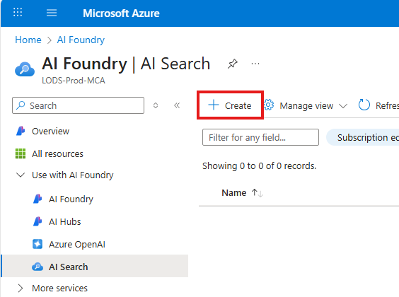
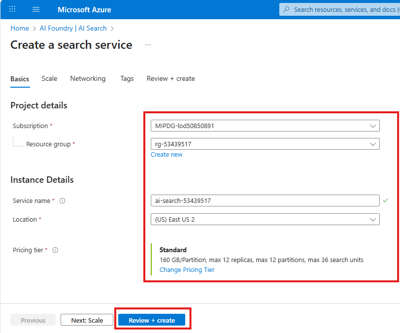
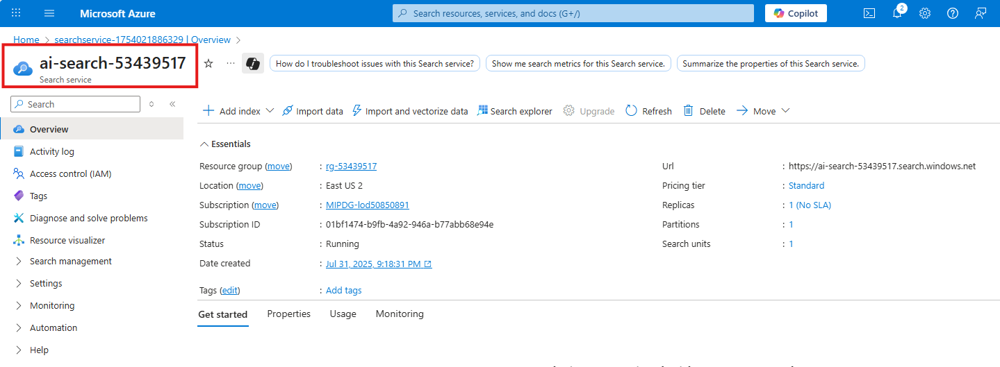

# Optional - Create AI Search service in Azure Portal

## Introduction 

This lab walks you through the steps to create an AI Search service in Azure Portal. This is an optional step for this lab as this AI Search service should have been provisioned at the launch of this lab.

## Objectives 
 List the objectives
In this lab we will:
-	

## Estimated Time 

15 minutes 

## Scenario

## Pre-requisites

## 🛠️ Tasks

### 1. Sign in to Azure Portal

Go to [https://portal.azure.com](https://portal.azure.com) and sign in with your Azure credentials.

### 2. Search for "ai search"

- In the top search bar, type **ai search**
- Select **AI Search** from the search results

### 3. Create AI Search

- Click **+ Create**

### 4. Fill in the details and deploy

- Choose the Subscription if not filled in automatically
- Choose the correct Resource Group (eg rg-53439517)
- Give a Service name (eg ai-search-53439517)
- Choose Location (eg East US 2)
- Keep Pricing tier as Standard
- Click **Review + Create** button
- Next screen, Click **Create** button
- In less than 2 minutes your deployment should complete

## ✅ Completed
Verify Deployment
- Click **Go to resource**
- You can find the Bing resource you just created.

