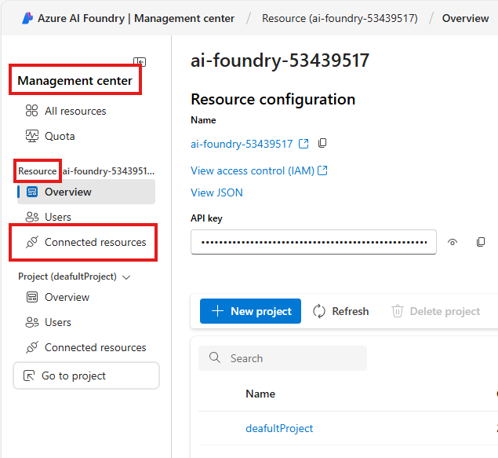

# Create connections to Bing Resources at Azure AI Foundry resource level

## Introduction 

This lab walks you through the steps to deploy various models into the **Azure AI Foundry** project.

## Objectives 
 List the objectives
In this lab we will:
-	

## Estimated Time 

30 minutes 

## Scenario

## Pre-requisites

## 🛠️ Tasks

### 1. Sign in to Azure Portal

Go to [https://portal.azure.com](https://portal.azure.com) and sign in with your Azure credentials.

### 2. Search for "Azure AI Foundry"

- In the top search bar, type **"Azure AI Foundry"**
- Select **Azure AI Foundry** from the search results

### 1. Sign in to Azure AI Foundry portal

- Go to [https://ai.azure.com](https://ai.azure.com/) and sign in with your Azure credentials.
- Click **Azure AI Foundry** at the top left
- Click Your AI Foundry (eg ai-foundry-53439517)

### 2. Connected Resources

- Left side, in the **Management center**, in the Resource section, Click **Connected resources**

- Click **+New connection**
- Search **bing**
- Click **Grounding with Bing Search**

- Click **Create a new resource**
- it will take you to the Azure Portal and you need to fill details
- Choose Subscription if not filled in automatically
- Choose Resource group (eg rg-53439517)
- Give a name (eg bing-53439517)
- Choose the available Pricing tier (eg Grounding with Bing Search ($35 per 1K transactions)
- Scroll down to select a checkbox
- Click **Review + create**, and then **Create**

## ✅ Completed. Verify models deployment

- In the left side menu, scroll down to the bottom, Click **Models + endpoints**
- You can see list of models deployed

