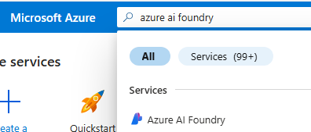

# 🧪 Lab Prerequisite: Creating a Hub in Azure AI Foundry via Azure Portal

This guide walks you through the steps to create a **Hub** in **Azure AI Foundry** using the **Azure Portal**. This is a required setup step before proceeding with lab exercises involving AI Foundry capabilities.

## 💡 What is a Hub?

A hub in Azure AI Foundry is a top-level resource that centralize security, connectivity, and computing management across projects. Hub allows developers to create projects and access shared resources without needing repeated IT administrator assistance.

## 🛠️ Step-by-Step Instructions

### 1. Sign in to Azure Portal

Go to [https://portal.azure.com](https://portal.azure.com) and sign in with your Azure credentials.

### 2. Search for "Azure AI Foundry"

- In the top search bar, type **"Azure AI Foundry"**
- Select **Azure AI Foundry** from the search results

### 3. Select "AI Hubs"

- In the left side menu, expand **"Use with AI Foundry"**
- Select **AI Hubs**

### 4. Create a New Hub

- Expand **down arrow** to the right of **+ Create**
- Select **Hub**

#### Fill in the following details:

| Field | Description |
|-------|-------------|
| **Subscription** | Select your Azure subscription, if not pre-filled |
| **Resource Group** | Choose an existing one |
| **Region** | Select a supported region (e.g., East US 2, West Europe) |
| **Name** | Provide a globally unique name for your Hub |
| **Friendly Name** | Optionally provide a name |

Leave defaults for remaining.

### 4. Review and Create

- Click **Review+create**
- Validate the configuration
- Click **Create** after **Validation passed** to deploy the Hub

Deployment may take a few minutes.

### 5. Verify Deployment

Once deployment is complete:

- Click **Go to resource**
- You should see the **Overview** details for the hub you just created.

## ✅ Completed

Once your Hub is created, you can access the hub many ways:
- Option 1: Azure Portal -> Azure AI Foundry -> AI Hubs -> Choose Your Hub
- Option 2: Go to [https://ai.azure.com](https://ai.azure.com) -> **Azure AI Foundry** at the top left -> "View all resources" -> Choose Your Hub

